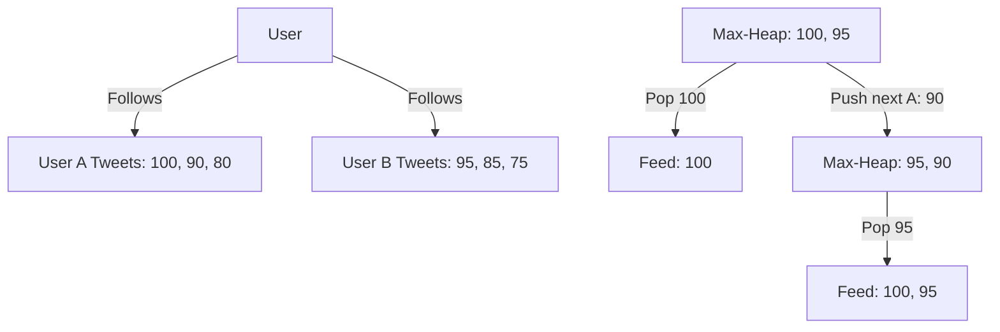

# 🐦 Heap: Design Twitter

## 📝 Description
[LeetCode 355](https://leetcode.com/problems/design-twitter/)
Design a simplified version of Twitter where users can post tweets, follow/unfollow another user and is able to see the 10 most recent tweets in the user's news feed.

!!! info "Real-World Application"
    This is a classic **News Feed** system design problem. It demonstrates **Fan-Out on Read** (Pull Model), where a user's feed is constructed on the fly by merging the sorted timelines of everyone they follow.

## 🛠️ Constraints & Edge Cases
- At most $500$ calls to each method.
- **Edge Cases to Watch:**
    - User follows themself (shouldn't double count tweets).
    - User has no tweets or follows no one.
    - Feed has fewer than 10 tweets total.

---

## 🧠 Approach & Intuition

!!! success "The Aha! Moment"
    Instead of sorting all tweets from all followed users ($O(N \log N)$), we can treat each user's tweet history as a sorted list (timestamp descending). The problem then becomes **Merging K Sorted Lists**. We can use a **Max-Heap** to efficiently pull the 10 most recent tweets.

### 🐢 Brute Force (Naive)
Collect all tweets from all followees into a single list, sort by time, return top 10.
- **Time Complexity:** $O(N \log N)$ where N is total tweets of all followees.

### 🐇 Optimal Approach
1.  **Data Structures:**
    - `tweet_map`: `userId -> list of [count, tweetId]` (most recent first).
    - `follow_map`: `userId -> set of followeeIds`.
2.  **Get News Feed:**
    - Initialize a Max-Heap.
    - Push the *most recent* tweet from each followee (and self) into the heap: `(count, tweetId, followeeId, index_in_list)`.
    - **Loop 10 times:**
        - Pop max (most recent). Add to result.
        - If the user has more older tweets, push the next one into the heap.

### 🧩 Visual Tracing


---

## 💻 Solution Implementation

```python
(Implementation details need to be added...)
```

### ⏱️ Complexity Analysis
- **Time Complexity:** `getNewsFeed` is $O(10 \cdot \log K)$ where $K$ is number of followees.
- **Space Complexity:** $O(U + T)$ for storing users and tweets.

---

## 🎤 Interview Toolkit

- **Design Question:** How to scale this? (Fan-out on Write for celebrities, Cache recent feeds).
- **Deep Dive:** Why min-heap with negative numbers vs max-heap? (Python only has min-heap).

## 🔗 Related Problems
- [Merge k Sorted Lists](../../06_linked_list/merge_k_sorted_lists/PROBLEM.md) — Core algorithm used here
- [Task Scheduler](../task_scheduler/PROBLEM.md) — Heap usage
