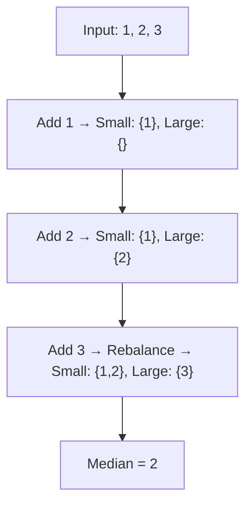

# ⚖️ Heap: Find Median from Data Stream

## 📝 Description
[LeetCode 295](https://leetcode.com/problems/find-median-from-data-stream/)
The median is the middle value in an ordered integer list. If the size of the list is even, there is no middle value, and the median is the mean of the two middle values. Design a data structure that supports adding integers and finding the median.

!!! info "Real-World Application"
    Used in **Real-time Analytics** to calculate p50 latency or other percentiles on streaming data without storing/sorting the entire dataset history.

## 🛠️ Constraints & Edge Cases
- $1 \le \text{calls} \le 5 \cdot 10^4$
- $-10^5 \le num \le 10^5$
- **Edge Cases to Watch:**
    - No elements (usually constraints say at least 1 for findMedian).
    - Single element.

---

## 🧠 Approach & Intuition

!!! success "The Aha! Moment"
    We need the middle element. Sorting every time is $O(N \log N)$. Maintaining a sorted list is $O(N)$ insertion. We can maintain the **middle** property by splitting the data into two halves: a **Small Half** (Max-Heap) and a **Large Half** (Min-Heap). The top of these heaps will be the candidates for the median.

### 🐢 Brute Force (Naive)
Append to list, sort on `findMedian`.
- **Time Complexity:** $O(N \log N)$ per call.

### 🐇 Optimal Approach
1.  **Heaps:**
    - `small`: Max-Heap (stores lower half of numbers).
    - `large`: Min-Heap (stores upper half of numbers).
2.  **AddNum(num):**
    - Push to `small` (Max-Heap).
    - Pop max from `small` and push to `large` (Min-Heap).
    - **Balance:** If `len(small) < len(large)`, move top of `large` back to `small`.
    - Invariant: `len(small) >= len(large)`.
3.  **FindMedian:**
    - If `len(small) > len(large)`: Return `small.top`.
    - Else: Return `(small.top + large.top) / 2.0`.

### 🧩 Visual Tracing


---

## 💻 Solution Implementation

```python
(Implementation details need to be added...)
```

### ⏱️ Complexity Analysis
- **Time Complexity:** $O(\log N)$ for `addNum`, $O(1)$ for `findMedian`.
- **Space Complexity:** $\mathcal{O}(N)$ — Store all numbers.

---

## 🎤 Interview Toolkit

- **Follow-up:** If all integers are in range [0, 100], how to optimize? (Use a frequency array/Bucket Sort logic).
- **Follow-up:** If 99% of calls are `addNum`, is this efficient? (Yes, log N is good).

## 🔗 Related Problems
