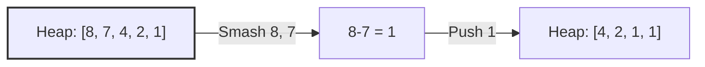

# 🪨 Heaps: Last Stone Weight

## 📝 Problem Description
Given an array of stone weights, repeatedly smash the two heaviest stones together. If $x == y$, both are destroyed; if $x < y$, $x$ is destroyed and $y$ becomes $y - x$. Return the weight of the last stone remaining, or 0.

!!! info "Real-World Application"
    Priority Queues (Heaps) are essential for:
    - **Task Scheduling:** Prioritizing jobs in operating systems.
    - **Bandwidth Management:** Prioritizing critical network traffic.
    - **Simulation:** Event-driven simulations (e.g., waiting lines in banks).

## 🛠️ Constraints & Edge Cases
- $1 \le \text{stones.length} \le 30$
- $1 \le \text{stones[i]} \le 1000$
- **Edge Cases to Watch:** 
    - No stones left (return 0).
    - Only one stone left (return its weight).
    - Two stones of equal weight.

---

## 🧠 Approach & Intuition

!!! success "The Aha! Moment"
    Since we always need the *heaviest* two stones, a Max-Heap is ideal. Python’s `heapq` is a Min-Heap, so negate the weights to simulate a Max-Heap efficiently.

### 🐢 Brute Force (Naive)
Sorting the array after every smash ($O(N^2 \log N)$), which is highly inefficient for frequent updates.

### 🐇 Optimal Approach
Use a Max-Heap to manage stone weights.
1. Build a Max-Heap from the `stones` list.
2. While the heap size $> 1$:
    - Pop the two heaviest stones, $y$ and $x$.
    - If $y > x$, push $y - x$ back onto the heap.
3. If the heap is empty, return 0, otherwise return the top element.

### 🧩 Visual Tracing


---

## 💻 Solution Implementation

```python
(Implementation details need to be added...)
```

### ⏱️ Complexity Analysis
- **Time Complexity:** $\mathcal{O}(N \log N)$ — Each `heappop` and `heappush` is $\mathcal{O}(\log N)$, performed $N$ times.
- **Space Complexity:** $\mathcal{O}(N)$ — To store the stones in the heap.

---

## 🎤 Interview Toolkit

- **Harder Variant:** Implement the Heap from scratch with `bubbleUp`/`bubbleDown` operations.
- **Alternative Data Structures:** Balanced BST (like `std::set` in C++), but slower than a heap for this specific use case.

## 🔗 Related Problems
- [Kth Largest Element in an Array](../kth_largest_element_in_an_array/PROBLEM.md) — Fundamental heap application.
- [Task Scheduler](../task_scheduler/PROBLEM.md) — Complex task management using heaps.
