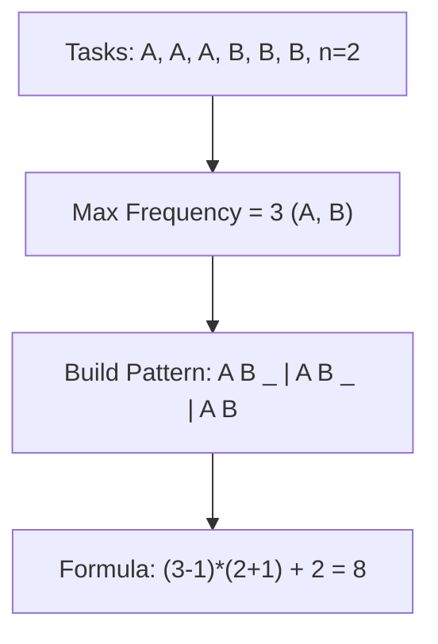

# 🕒 Heap: Task Scheduler

## 📝 Description
[LeetCode 621](https://leetcode.com/problems/task-scheduler/)
Given a characters array `tasks`, representing the tasks a CPU needs to do, where each letter represents a different task. Tasks could be done in any order. Each task is done in one unit of time. For each unit of time, the CPU could complete either one task or just be idle. However, there is a non-negative integer `n` that represents the cooldown period between two same tasks (the same letter in the array), that is that there must be at least `n` units of time between any two same tasks. Return the least number of units of times that the CPU will take to finish all the given tasks.

!!! info "Real-World Application"
    Models **CPU Scheduling** in Operating Systems, where processes cannot run continuously without waiting for I/O or cooling down, or **Job Queues** with rate limiting per user.

## 🛠️ Constraints & Edge Cases
- $1 \le \text{tasks.length} \le 10^4$
- $0 \le n \le 100$
- **Edge Cases to Watch:**
    - `n = 0` (No cooling, time = length).
    - All tasks same (time = (count-1)*(n+1) + 1).

---

## 🧠 Approach & Intuition

!!! success "The Aha! Moment"
    The task with the **highest frequency** is the bottleneck. If 'A' appears 3 times and n=2, we need `A _ _ A _ _ A`. We must construct frames around these high-frequency tasks. We can calculate the slots mathematically without simulating.

### 🐢 Brute Force (Naive)
Simulate the scheduler using a Heap and a Queue. Pick max frequency task, execute, wait `n` steps.
- **Time Complexity:** $O(\text{time})$.

### 🐇 Optimal Approach (Math/Greedy)
1.  Find the maximum frequency `max_f` (e.g., 3).
2.  Count how many tasks have this max frequency `max_f_count` (e.g., A and B both have 3).
3.  Calculate the number of chunks/groups. We have `max_f - 1` full groups of size `n + 1`.
4.  Total time is determined by: `(max_f - 1) * (n + 1) + max_f_count`.
5.  **However**, if we have so many other tasks that we fill all idle slots and spill over, the answer is just `len(tasks)`.
6.  Result: `max(formula_result, len(tasks))`.

### 🧩 Visual Tracing


---

## 💻 Solution Implementation

```python
(Implementation details need to be added...)
```

### ⏱️ Complexity Analysis
- **Time Complexity:** $\mathcal{O}(N)$ — To count frequencies.
- **Space Complexity:** $\mathcal{O}(1)$ — Array of size 26.

---

## 🎤 Interview Toolkit

- **Alternative:** Can you simulate it with a Max-Heap and Queue? (Yes, pop max freq, process, push to queue with cooldown timestamp. When time >= timestamp, push back to heap).

## 🔗 Related Problems
- [Design Twitter](../design_twitter/PROBLEM.md) — Heap application
