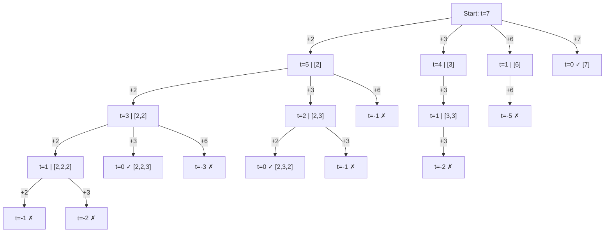

# 🎯 Backtracking: Combination Sum

## 📝 Description
[LeetCode 39](https://leetcode.com/problems/combination-sum/)
Given an array of distinct integers `candidates` and a target integer `target`, return a list of all unique combinations of `candidates` where the chosen numbers sum to `target`. You may return the combinations in any order. The same number may be chosen from `candidates` an unlimited number of times.

!!! info "Real-World Application"
    This is the **Unbounded Knapsack Problem**. It's used in **Coin Change** (making change for a dollar using specific denominations) or resource allocation where you can use multiple instances of the same resource type.

## 🛠️ Constraints & Edge Cases
- $1 \le \text{candidates.length} \le 30$
- $1 \le \text{target} \le 500$
- **Edge Cases to Watch:**
    - Target cannot be reached.
    - Candidates are larger than target.

---

## 🧠 Approach & Intuition

!!! success "The Aha! Moment"
    We need to make a series of decisions: "Do I take this number, or do I skip it?" Since we can reuse numbers, if we decide to *take* a number, we stay at the same index for the next recursion. If we *skip*, we move to the next index. This forms a decision tree.

### 🐢 Brute Force (Naive)
Try every possible combination of every length. Without pruning (stopping when sum > target), this would be infinite.

### 🐇 Optimal Approach (DFS)
1.  Define `backtrack(i, current_sum, current_list)`.
2.  **Base Case:** If `current_sum == target`, add copy of `current_list` to result.
3.  **Base Case:** If `current_sum > target` OR `i >= len(candidates)`, return.
4.  **Branch 1 (Include):**
    - Add `candidates[i]` to list.
    - Recurse with `(i, current_sum + candidates[i])` -> *Note: index `i` stays same*.
    - Backtrack (pop from list).
5.  **Branch 2 (Exclude):**
    - Recurse with `(i + 1, current_sum)`.

### 🧩 Visual Tracing


---

## 💻 Solution Implementation

```python
(Implementation details need to be added...)
```

### ⏱️ Complexity Analysis
- **Time Complexity:** $\mathcal{O}(2^T)$ — Roughly exponential based on Target/MinCandidate.
- **Space Complexity:** $\mathcal{O}(T)$ — Max depth of recursion (e.g., if we pick 1 repeated T times).

---

## 🎤 Interview Toolkit

- **Harder Variant:** Combination Sum II (No duplicates allowed).
- **Optimization:** Sort candidates and break loop early if `current_sum + candidates[i] > target`.

## 🔗 Related Problems
- [Combination Sum II](../combination_sum_ii/PROBLEM.md) — Next in category
- [Permutations](../permutations/PROBLEM.md) — Previous in category
