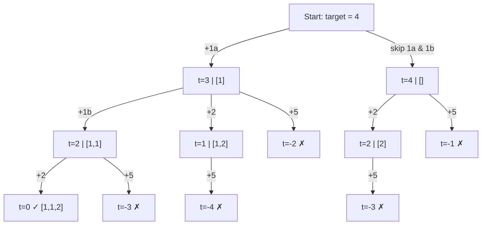

# 🎯 Backtracking: Combination Sum II

## 📝 Description
[LeetCode 40](https://leetcode.com/problems/combination-sum-ii/)
Given a collection of candidate numbers (`candidates`) and a target number (`target`), find all unique combinations in `candidates` where the candidate numbers sum to `target`. Each number in `candidates` may only be used once in the combination. The solution set must not contain duplicate combinations.

!!! info "Real-World Application"
    Similar to **Shopping Cart** logic (finding items that sum to a coupon threshold where items are unique entities), or finding subsets of data packets that fill a buffer exactly.

## 🛠️ Constraints & Edge Cases
- $1 \le \text{candidates.length} \le 100$
- **Edge Cases to Watch:**
    - Input contains duplicates (e.g., `[1, 1, 2]`).
    - Output must be unique sets (e.g., if we have two `1`s, `[1_a, 2]` and `[1_b, 2]` are the same set `[1, 2]`).

---

## 🧠 Approach & Intuition

!!! success "The Aha! Moment"
    The challenge is handling duplicates in the *input* to avoid duplicates in the *output*. If we sort the input first, identical numbers end up adjacent. In our recursion loop, if we decide to **skip** a number (say, the first `1`), we must also skip **all subsequent `1`s** at that specific tree level. Why? Because the "Include" branch of the first `1` already covers all combinations involving a `1`.

### 🐢 Brute Force (Naive)
Generate all subsets, filter by sum, convert to tuple/set to remove duplicates.
- **Time Complexity:** Extremely inefficient due to set storage and generation.

### 🐇 Optimal Approach (Backtracking with Sorting)
1.  **Sort** `candidates`.
2.  Define `backtrack(start_index, target)`.
3.  Loop `i` from `start_index` to end:
    - **Skip Duplicates:** If `i > start_index` and `candidates[i] == candidates[i-1]`, continue.
    - **Prune:** If `candidates[i] > target`, break (array is sorted, no point continuing).
    - **Recurse:** `backtrack(i + 1, target - candidates[i])`.
4.  Backtrack (pop).

### 🧩 Visual Tracing


---

## 💻 Solution Implementation

```python
(Implementation details need to be added...)
```

### ⏱️ Complexity Analysis
- **Time Complexity:** $\mathcal{O}(2^N)$ — Worst case all subsets.
- **Space Complexity:** $\mathcal{O}(N)$ — Recursion depth.

---

## 🎤 Interview Toolkit

- **Key Question:** Why do we check `i > pos`? (To ensure we allow picking `1, 1` in a vertical recursion branch, but prevent picking `1` (index 0) then `1` (index 1) as "first choices" at the same horizontal level).

## 🔗 Related Problems
- [Subsets II](../subsets_ii/PROBLEM.md) — Logic for duplicate handling is identical
- [Combination Sum](../combination_sum/PROBLEM.md) — Previous in category
