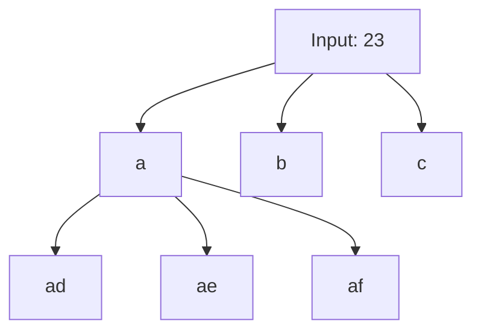

# 📞 Backtracking: Letter Combinations of a Phone Number

## 📝 Description
[LeetCode 17](https://leetcode.com/problems/letter-combinations-of-a-phone-number/)
Given a string containing digits from `2-9` inclusive, return all possible letter combinations that the number could represent. Return the answer in any order. A mapping of digits to letters (just like on the telephone buttons) is given below. Note that 1 does not map to any letters.

!!! info "Real-World Application"
    This is the core logic behind **T9 Predictive Text** on old phones, or brute-forcing a numeric PIN that might map to a dictionary word.

## 🛠️ Constraints & Edge Cases
- $0 \le \text{digits.length} \le 4$
- **Edge Cases to Watch:**
    - Empty string (return `[]`, NOT `[""]`).
    - Single digit.

---

## 🧠 Approach & Intuition

!!! success "The Aha! Moment"
    This is a classic combinatorial explosion. For each digit, we have 3 or 4 choices. If input is "23", we choose 'a','b', or 'c' for the first slot. For *each* of those, we choose 'd','e', or 'f' for the second. This branching structure is best solved with **Backtracking (DFS)**.

### 🐢 Brute Force (Naive)
Nested loops. Works for fixed length (e.g., 3 loops for 3 digits), but fails for variable length input.

### 🐇 Optimal Approach
1.  Map digits to chars: `{'2': "abc", ...}`.
2.  Define `backtrack(i, current_string)`.
3.  **Base Case:** If `len(current_string) == len(digits)`, add to result.
4.  **Recursive Step:**
    - Get characters for `digits[i]`.
    - Loop through each char `c`.
    - Recurse `backtrack(i + 1, current_string + c)`.

### 🧩 Visual Tracing


---

## 💻 Solution Implementation

```python
(Implementation details need to be added...)
```

### ⏱️ Complexity Analysis
- **Time Complexity:** $\mathcal{O}(4^N \cdot N)$ — Worst case (digits 7/9 have 4 chars). There are $4^N$ combinations, and building each string takes $N$.
- **Space Complexity:** $\mathcal{O}(N)$ — Recursion depth.

---

## 🎤 Interview Toolkit

- **Variant:** What if we had a dictionary of valid words? (Use a Trie to prune branches that don't form valid prefixes).

## 🔗 Related Problems
- [Permutations](../permutations/PROBLEM.md) — Similar generation
- [Generate Parentheses](../../04_stack/generate_parentheses/PROBLEM.md) — Similar recursion
