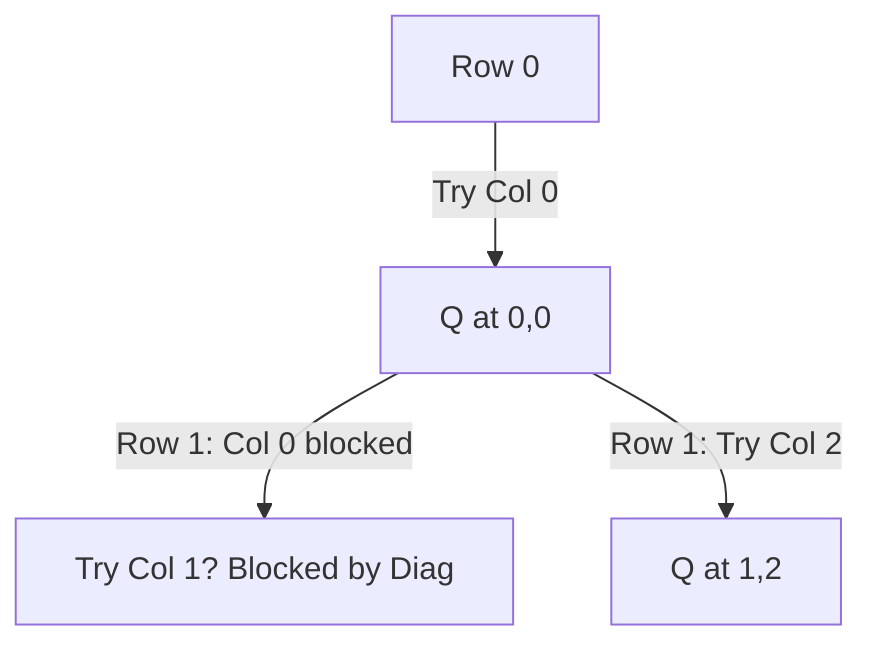

# 👑 Backtracking: N-Queens

## 📝 Description
[LeetCode 51](https://leetcode.com/problems/n-queens/)
The n-queens puzzle is the problem of placing `n` queens on an `n x n` chessboard such that no two queens attack each other. Return all distinct solutions to the n-queens puzzle.

!!! info "Real-World Application"
    This is a **Constraint Satisfaction Problem (CSP)**. It maps to problems like **Sudoku Solvers**, **Resource Allocation** (scheduling tasks that conflict on shared resources), and VLSI chip layout design.

## 🛠️ Constraints & Edge Cases
- $1 \le n \le 9$
- **Edge Cases to Watch:**
    - `n=1` (One solution: `[["Q"]]`).
    - `n=2` or `n=3` (No solution).

---

## 🧠 Approach & Intuition

!!! success "The Aha! Moment"
    A Queen attacks row, column, and diagonals.
    - **Row:** We place one queen per row, so this constraint is handled by recursion depth.
    - **Col:** Track occupied columns.
    - **Diagonals:** The trick is identifying diagonals.
        - **Positive Diagonal (/)**: `r + c` is constant.
        - **Negative Diagonal (\)**: `r - c` is constant.
    We can use 3 Sets to track these constraints in $O(1)$.

### 🐢 Brute Force (Naive)
Place N queens in all $N^2$ positions. Check board validity. Complexity: $O(N^N)$.

### 🐇 Optimal Approach
1.  Sets: `cols`, `posDiag`, `negDiag`.
2.  `backtrack(r)`:
    - If `r == n`: We found a valid board. Format and add to results.
    - Loop `c` from `0` to `n-1`:
        - If `c` in `cols` or `r+c` in `posDiag` or `r-c` in `negDiag`: Continue (Skip).
        - **Place Queen:** Add to sets, update board.
        - **Recurse:** `backtrack(r + 1)`.
        - **Backtrack:** Remove from sets, revert board.

### 🧩 Visual Tracing


---

## 💻 Solution Implementation

```python
(Implementation details need to be added...)
```

### ⏱️ Complexity Analysis
- **Time Complexity:** $\mathcal{O}(N!)$ — First row has N choices, second has N-1 (roughly), etc.
- **Space Complexity:** $\mathcal{O}(N^2)$ — Board storage + recursion stack + constraint sets.

---

## 🎤 Interview Toolkit

- **Optimization:** Use Bitmasks (integers) instead of Sets for `cols`, `diags` to speed up constant factors.
- **Variant:** N-Queens II (Just count solutions, don't return boards).

## 🔗 Related Problems
- [Permutations](../permutations/PROBLEM.md) — Related recursion
