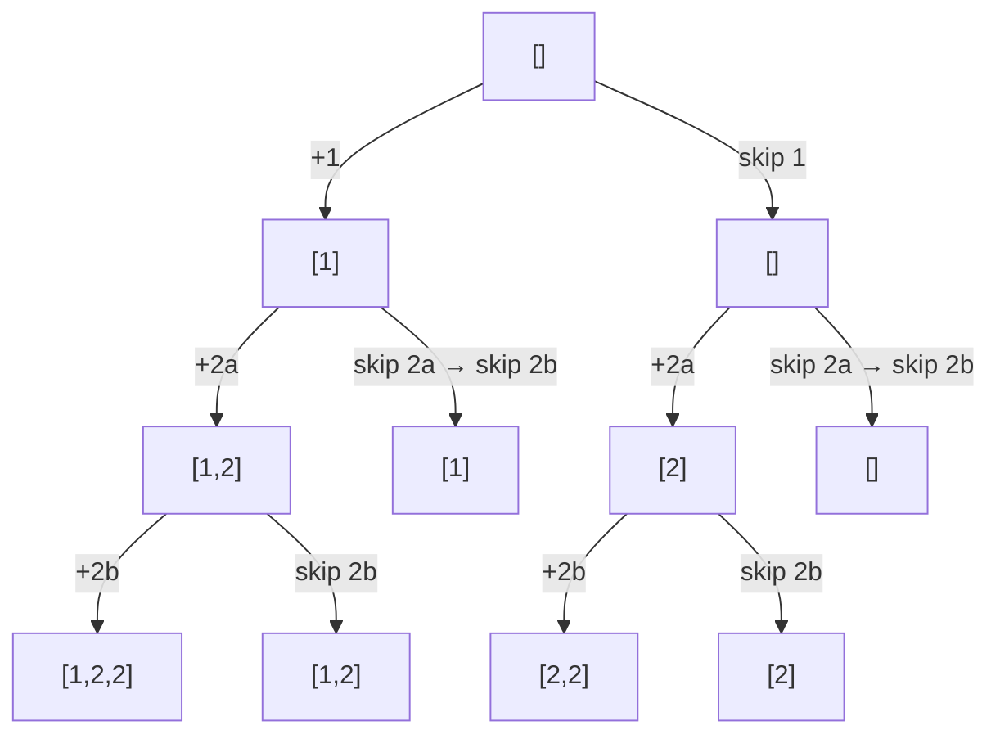

# 🌳 Backtracking: Subsets II

## 📝 Description
[LeetCode 90](https://leetcode.com/problems/subsets-ii/)
Given an integer array `nums` that may contain duplicates, return all possible subsets (the power set). The solution set must not contain duplicate subsets. Return the solution in any order.

!!! info "Real-World Application"
    **Feature Selection** in Machine Learning (trying all subsets of features where some features might be effectively identical/correlated), or configuration testing with redundant components.

## 🛠️ Constraints & Edge Cases
- $1 \le nums.length \le 10$
- **Edge Cases to Watch:**
    - All elements identical (`[2, 2, 2]`).
    - No elements.

---

## 🧠 Approach & Intuition

!!! success "The Aha! Moment"
    Just like Combination Sum II, the key is to **Sort** the input first. When we decide NOT to include `nums[i]`, we must skip all subsequent occurrences of `nums[i]` to prevent generating the same subset in a different branch.

### 🐢 Brute Force (Naive)
Generate all subsets ($2^N$), sort elements within each subset, convert to Set to remove duplicates. Slow.

### 🐇 Optimal Approach
1.  **Sort** `nums`.
2.  `backtrack(i, subset)`:
    - Add `subset` to result.
    - Loop `j` from `i` to `len(nums)`:
        - If `j > i` and `nums[j] == nums[j-1]`: Continue (Skip duplicates).
        - Add `nums[j]` to `subset`.
        - Recurse `backtrack(j + 1, subset)`.
        - Backtrack (pop).

### 🧩 Visual Tracing


---

## 💻 Solution Implementation

```python
(Implementation details need to be added...)
```
*(Note: This implementation uses the "Include/Exclude" pattern which is slightly different from the loop pattern but cleaner for subsets).*

### ⏱️ Complexity Analysis
- **Time Complexity:** $\mathcal{O}(N \cdot 2^N)$ — $2^N$ subsets, $O(N)$ to copy/build.
- **Space Complexity:** $\mathcal{O}(N)$ — Recursion stack.

---

## 🎤 Interview Toolkit

- **Comparison:** Include/Exclude logic vs For-Loop logic. Both work. For loop logic naturally handles duplicates with `continue`, Include/Exclude needs a `while` loop to skip.

## 🔗 Related Problems
- [Subsets](../subsets/PROBLEM.md) — No duplicates
- [Combination Sum II](../combination_sum_ii/PROBLEM.md) — Same dup logic
