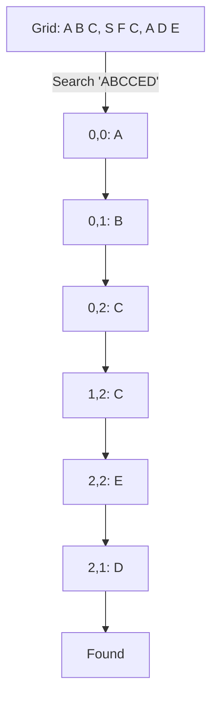

# 🔎 Backtracking: Word Search

## 📝 Description
[LeetCode 79](https://leetcode.com/problems/word-search/)
Given an `m x n` grid of characters `board` and a string `word`, return `true` if `word` exists in the grid. The word can be constructed from letters of sequentially adjacent cells, where adjacent cells are horizontally or vertically neighboring. The same letter cell may not be used more than once.

!!! info "Real-World Application"
    Solving puzzle games like **Boggle**, searching for spatial patterns in grids, or pathfinding on a grid with specific waypoint constraints.

## 🛠️ Constraints & Edge Cases
- $m, n \le 6$
- $1 \le word.length \le 15$
- **Edge Cases to Watch:**
    - Word longer than grid total cells.
    - Word has characters not in grid.

---

## 🧠 Approach & Intuition

!!! success "The Aha! Moment"
    This is a pathfinding problem. We need to find *a* path that matches the string. **DFS** is natural here. We start DFS from every cell that matches the first letter. To ensure we don't reuse cells, we temporarily mark the board cell as "visited" (e.g., `#`) and restore it (backtrack) after returning from recursion.

### 🐢 Brute Force (Naive)
DFS from every single cell.
- **Time Complexity:** $O(M \cdot N \cdot 4^L)$ where L is word length.

### 🐇 Optimal Approach
1.  Iterate `r` from 0 to rows, `c` from 0 to cols.
2.  If `board[r][c] == word[0]`, call `dfs(r, c, 0)`.
3.  **DFS(r, c, i):**
    - **Base:** If `i == len(word)`, return True.
    - **Boundaries:** If out of bounds or `board[r][c] != word[i]`, return False.
    - **Mark:** `tmp = board[r][c]`, `board[r][c] = '#'`.
    - **Recurse:** Check 4 directions for `i + 1`.
    - **Backtrack:** `board[r][c] = tmp`.
    - Return result.

### 🧩 Visual Tracing


---

## 💻 Solution Implementation

```python
(Implementation details need to be added...)
```
*(Note: Using a Set `path` is easier to read, but modifying `board` in-place saves $O(L)$ space).*

### ⏱️ Complexity Analysis
- **Time Complexity:** $\mathcal{O}(N \cdot M \cdot 4^L)$.
- **Space Complexity:** $\mathcal{O}(L)$ — Recursion depth.

---

## 🎤 Interview Toolkit

- **Optimization:** Check frequencies first! If `word` has 5 'A's but board only has 3, return False immediately.
- **Optimization:** Search for `word[::-1]` if `word` suffix is rarer than prefix on the board.

## 🔗 Related Problems
- [Word Search II](../word_search_ii/PROBLEM.md) — Find multiple words (Uses Trie)
