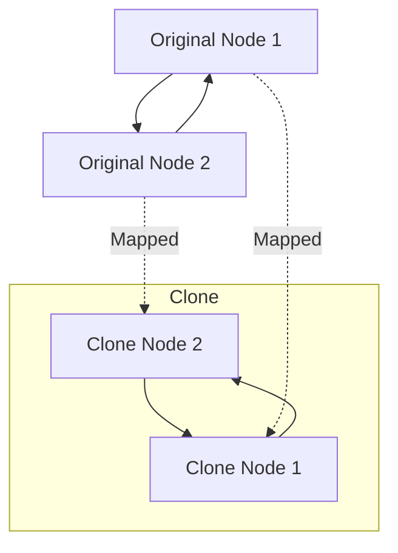

# 🎭 Graphs: Clone Graph

## 📝 Problem Description
Given a reference of a node in a connected undirected graph, return a [deep copy (clone)](https://leetcode.com/problems/clone-graph/) of the graph. Each node in the graph contains a value (`int`) and a list (`List[Node]`) of its neighbors.

!!! info "Real-World Application"
    Deep copying graphs is essential for **serializing object graphs** in distributed systems (e.g., deep-cloning an object state before sending it across a network) and in **compilers/ASTs** where a tree or graph needs to be cloned to perform transformations without affecting the original.

## 🛠️ Constraints & Edge Cases
- $0 \le \text{Node.val} \le 100$
- There are no repeated values in the graph.
- The graph is connected and undirected.
- **Edge Cases to Watch:** 
    - Empty graph (node is null).
    - Single node graph.
    - Graph with cycles.

---

## 🧠 Approach & Intuition

!!! success "The Aha! Moment"
    The key is to treat the graph as a recursive structure while maintaining a **mapping of original nodes to their corresponding clones**. This mapping acts as a "visited" set and ensures we only create one new clone per original node, preventing infinite loops in cyclic graphs.

### 🐢 Brute Force (Naive)
A naive recursive approach that doesn't track visited nodes would attempt to infinitely recurse into already-processed neighbors, leading to an infinite loop and stack overflow for any graph with cycles.

### 🐇 Optimal Approach (DFS/BFS + HashMap)
1. Initialize a hash map `visited` to store `original_node: cloned_node`.
2. Start traversal from the input node (using DFS or BFS).
3. If the current node is in `visited`, return the existing clone.
4. If not, create a new clone, add it to `visited`, and recursively/iteratively clone its neighbors.
5. Connect the current clone to the newly created/retrieved neighbor clones.

### 🧩 Visual Tracing


---

## 💻 Solution Implementation

```python
(Implementation details need to be added...)
```

### ⏱️ Complexity Analysis
- **Time Complexity:** $\mathcal{O}(V + E)$, where $V$ is the number of vertices and $E$ is the number of edges. We visit each node and edge exactly once.
- **Space Complexity:** $\mathcal{O}(V)$ to store the clone map and the recursion stack (for DFS) or queue (for BFS).

---

## 🎤 Interview Toolkit

- **Alternative Approach:** BFS can also solve this iteratively using a `collections.deque` and the same hash map logic.
- **Related Problems:**
    - `[Copy List with Random Pointer](../06_linked_list/copy_list_with_random_pointer/PROBLEM.md)` — Similar deep-copy pattern but for linked lists.
    - `[Number of Islands](../number_of_islands/PROBLEM.md)` — Fundamental graph traversal problem.
