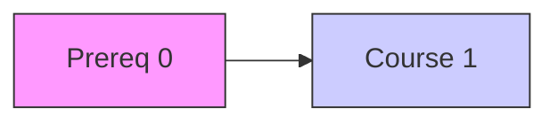

# 🎓 Graphs: Course Schedule

## 📝 Problem Description
There are a total of `numCourses` courses you have to take, labeled from `0` to `numCourses - 1`. You are given an array `prerequisites` where `prerequisites[i] = [a, b]` indicates that you must take course `b` first if you want to take course `a`. Return `true` if you can finish all courses; otherwise, return `false`.

!!! info "Real-World Application"
    This is the fundamental problem of **Topological Sorting**. It is used extensively in **package management systems** (like `npm` or `pip`) to determine the installation order of dependencies, in **build systems** (like `Make` or `Bazel`), and in **task scheduling** to ensure prerequisites are met before execution.

## 🛠️ Constraints & Edge Cases
- $1 \le \text{numCourses} \le 2000$
- $0 \le \text{prerequisites.length} \le 5000$
- **Edge Cases to Watch:** 
    - Disconnected components in the graph.
    - No prerequisites (should return `true`).
    - Cyclic dependencies (should return `false`).

---

## 🧠 Approach & Intuition

!!! success "The Aha! Moment"
    A course schedule is possible **if and only if there are no cycles** in the dependency graph. A cycle-free directed graph is a Directed Acyclic Graph (DAG), which can always be topologically sorted. Kahn's Algorithm (BFS) is the standard way to detect cycles.

### 🐢 Brute Force (Naive)
Using DFS to detect cycles in every path is possible, but managing the "recursion stack" state properly is complex and often leads to $O(V!)$ complexity if implemented naively.

### 🐇 Optimal Approach (Kahn's Algorithm - BFS)
1. Calculate the **in-degree** of each course (number of prerequisites).
2. Use a queue to store all courses with an in-degree of 0 (no prerequisites).
3. While the queue is not empty, "take" a course, remove it from the graph, and decrement the in-degrees of its dependent courses.
4. If a dependent course's in-degree reaches 0, add it to the queue.
5. If the total number of courses "taken" equals `numCourses`, return `true`; otherwise, there's a cycle.

### 🧩 Visual Tracing


---

## 💻 Solution Implementation

```python
(Implementation details need to be added...)
```

### ⏱️ Complexity Analysis
- **Time Complexity:** $\mathcal{O}(V + E)$, where $V$ is `numCourses` and $E$ is the number of prerequisite pairs.
- **Space Complexity:** $\mathcal{O}(V + E)$ to store the graph and the in-degree array.

---

## 🎤 Interview Toolkit

- **Harder Variant:** Use DFS-based cycle detection (requires keeping track of `visiting` vs `visited` state).
- **Related Problems:**
    - `[Course Schedule II](../course_schedule_ii/PROBLEM.md)` — Return the order instead of just checking feasibility.
    - `[Alien Dictionary](../../12_advanced_graphs/alien_dictionary/PROBLEM.md)` — Advanced topological sort application.
