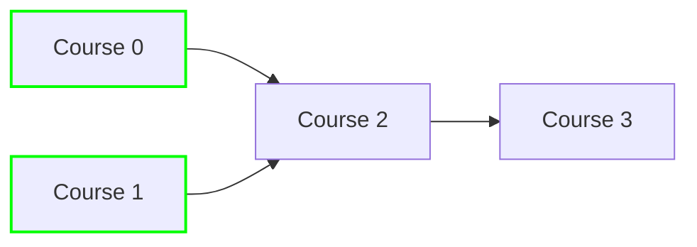

# 🎓 Graphs: Course Schedule II

## 📝 Problem Description
[LeetCode 210: Course Schedule II](https://leetcode.com/problems/course-schedule-ii/)

There are a total of `numCourses` courses you have to take, labeled from `0` to `numCourses - 1`. You are given an array `prerequisites` where `prerequisites[i] = [ai, bi]` indicates that you must take course `bi` first if you want to take course `ai`.

Return the ordering of courses you should take to finish all courses. If there are many valid answers, return any of them. If it is impossible to finish all courses, return an empty array.

!!! info "Real-World Application"
    Dependency resolution in build systems (like `npm`, `pip`, or `make`), task scheduling in operating systems, and resolving complex software module loading orders.

## 🛠️ Constraints & Edge Cases
- $1 \le \text{numCourses} \le 2000$
- $0 \le \text{prerequisites.length} \le \text{numCourses} * (\text{numCourses} - 1)$
- **Edge Cases:** No prerequisites, cyclic dependencies, disconnected components.

---

## 🧠 Approach & Intuition

!!! success "The Aha! Moment"
    A cycle in a directed graph makes a topological ordering impossible. We can use Kahn's algorithm (BFS-based topological sort) by repeatedly peeling off nodes with an `indegree` of 0.

### 🐢 Brute Force (Naive)
Generating all $N!$ permutations and checking if each is valid is $\mathcal{O}(N! \cdot (N + E))$, which will time out for even small $N$.

### 🐇 Optimal Approach
Use Kahn's Algorithm:
1. Build an adjacency list and calculate the `indegree` for all nodes.
2. Add all nodes with `indegree == 0` to a queue.
3. While the queue is not empty:
    a. Remove a node $u$, add it to the `topo_order`.
    b. For each neighbor $v$ of $u$, decrement `indegree[v]`.
    c. If `indegree[v]` becomes 0, add $v$ to the queue.
4. If `len(topo_order) == numCourses`, return the order, else return `[]` (cycle detected).

### 🧩 Visual Tracing


---

## 💻 Solution Implementation

```python
(Implementation details need to be added...)
```

### ⏱️ Complexity Analysis
- **Time Complexity:** $\mathcal{O}(V + E)$ where $V$ is the number of courses and $E$ is the number of prerequisite edges. Each node and edge is processed once.
- **Space Complexity:** $\mathcal{O}(V + E)$ to store the adjacency list and indegree array.

---

## 🎤 Interview Toolkit

- **Harder Variant:** What if you need the lexicographically smallest ordering? Use a Min-Heap instead of a Queue.
- **Alternative:** DFS-based topological sort (Post-order traversal + reversing).

## 🔗 Related Problems
- `[Course Schedule](../course_schedule/PROBLEM.md)`
- `[Graph Valid Tree](../graph_valid_tree/PROBLEM.md)`
