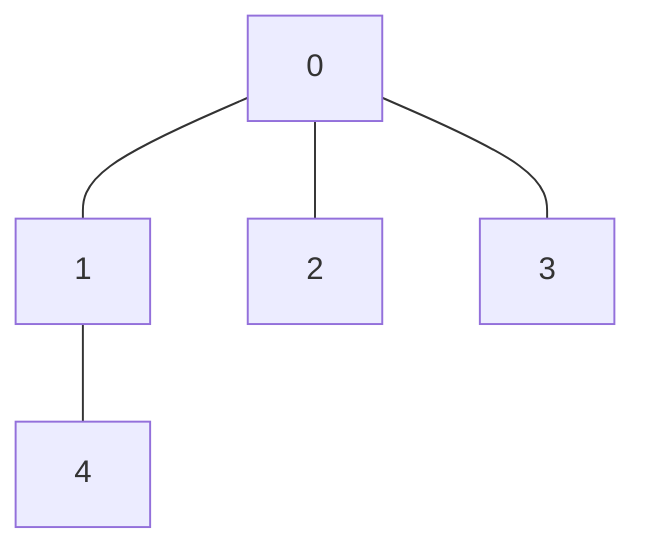

# 🌳 Graphs: Graph Valid Tree

## 📝 Problem Description
[LeetCode 261: Graph Valid Tree](https://leetcode.com/problems/graph-valid-tree/)

Given `n` nodes labeled from `0` to `n - 1` and a list of `edges` (each edge is a pair of nodes), write a function to check whether these edges make up a valid tree.

!!! info "Real-World Application"
    Network topology management, directory file structures, and ensuring data integrity in hierarchical databases.

## 🛠️ Constraints & Edge Cases
- $1 \le n \le 2000$
- $0 \le \text{edges.length} \le 5000$
- **Edge Cases:** Single node tree (0 edges), cyclic graphs, disconnected components.

---

## 🧠 Approach & Intuition

!!! success "The Aha! Moment"
    A graph with $N$ nodes is a tree if and only if it has exactly $N-1$ edges AND is fully connected.

### 🐢 Brute Force (Naive)
Try to find all cycles using DFS/BFS and check for reachability from a root. This is $\mathcal{O}(N+E)$ but often implemented inefficiently by re-traversing components.

### 🐇 Optimal Approach
1. If `len(edges) != n - 1`, return `False` immediately.
2. Build an adjacency list.
3. Perform a DFS or BFS from node 0.
4. If the total number of unique visited nodes is $n$, return `True`.

### 🧩 Visual Tracing


---

## 💻 Solution Implementation

```python
(Implementation details need to be added...)
```

### ⏱️ Complexity Analysis
- **Time Complexity:** $\mathcal{O}(V + E)$ where $V$ is the number of nodes and $E$ is the number of edges. We traverse all nodes and edges once.
- **Space Complexity:** $\mathcal{O}(V + E)$ for the adjacency list and recursion stack/visited set.

---

## 🎤 Interview Toolkit

- **Alternative:** Disjoint Set Union (DSU). Union-Find is highly efficient here.
- **Edge Case Probe:** A graph with 0 edges and 1 node is a valid tree.

## 🔗 Related Problems
- `[Number of Connected Components](../number_of_connected_components_in_graph/PROBLEM.md)`
- `[Course Schedule II](../course_schedule_ii/PROBLEM.md)`
