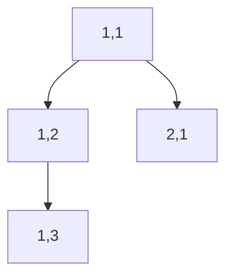

# 🏝️ Graphs: Max Area of Island

## 📝 Problem Description
[LeetCode 695: Max Area of Island](https://leetcode.com/problems/max-area-of-island/)

Given an `m x n` 2D binary grid `grid`, where `1` represents land and `0` represents water, return the maximum area of an island in `grid`. An island is a 4-directionally connected group of `1`s.

!!! info "Real-World Application"
    Computer Vision (object segmentation/labeling), image processing, and pathfinding in grid-based environments.

## 🛠️ Constraints & Edge Cases
- $m == \text{grid.length}$
- $n == \text{grid[i].length}$
- $1 \le m, n \le 50$
- **Edge Cases:** Entirely water grid, entire grid is land.

---

## 🧠 Approach & Intuition

!!! success "The Aha! Moment"
    Instead of using a `visited` array, we can modify the grid in-place ("sink" the land) by setting `grid[r][c] = 0` after visiting a cell to save space.

### 🐢 Brute Force (Naive)
Iterating over the grid and starting a new BFS for every cell found would work but might be redundant if we don't track visited nodes properly, leading to $\mathcal{O}((MN)^2)$.

### 🐇 Optimal Approach
Use DFS to explore each island:
1. Iterate over all cells $(r, c)$.
2. If `grid[r][c] == 1`, call `dfs(r, c)` to calculate the area of the island.
3. In `dfs`, mark the current cell as `0` and return `1 + sum of DFS calls on neighbors`.
4. Keep track of the maximum area found.

### 🧩 Visual Tracing


---

## 💻 Solution Implementation

```python
(Implementation details need to be added...)
```

### ⏱️ Complexity Analysis
- **Time Complexity:** $\mathcal{O}(M \times N)$ where $M$ is the number of rows and $N$ is the number of columns. Each cell is visited at most once.
- **Space Complexity:** $\mathcal{O}(M \times N)$ in the worst case (e.g., all land) for the recursion stack.

---

## 🎤 Interview Toolkit

- **Follow-up:** Can you solve this using BFS? (Yes, use a queue).
- **Modification:** How do you find the *perimeter* of the island?

## 🔗 Related Problems
- `[Number of Islands](../number_of_islands/PROBLEM.md)`
- `[Number of Connected Components](../number_of_connected_components_in_graph/PROBLEM.md)`
