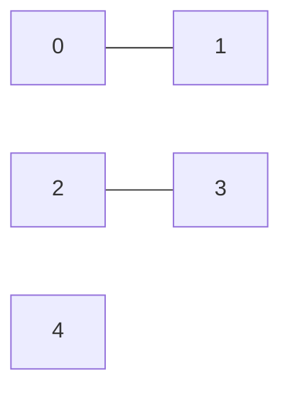

# 🔗 Graphs: Number of Connected Components

## 📝 Problem Description
[LeetCode 323: Number of Connected Components in an Undirected Graph](https://leetcode.com/problems/number-of-connected-components-in-an-undirected-graph/)

Given `n` nodes labeled from `0` to `n - 1` and a list of undirected `edges`, return the number of connected components in the graph.

!!! info "Real-World Application"
    Cluster analysis, network connectivity in infrastructure, and identifying isolated groups in social networks.

## 🛠️ Constraints & Edge Cases
- $1 \le n \le 2000$
- $0 \le \text{edges.length} \le 5000$
- **Edge Cases:** No edges, graph with nodes that are not connected, cyclic graphs.

---

## 🧠 Approach & Intuition

!!! success "The Aha! Moment"
    A connected component is just a set of nodes reachable from each other. If we traverse the graph using DFS/BFS and count how many times we start a new traversal, that's our number of components.

### 🐢 Brute Force (Naive)
Could use BFS/DFS with a `visited` set to track. This is actually optimal at $\mathcal{O}(V+E)$.

### 🐇 Optimal Approach
1. Build an adjacency list from the undirected edges.
2. Maintain a `visited` set.
3. Iterate through all nodes from `0` to `n - 1`.
4. If a node has not been visited, increment the component count and run DFS/BFS to mark all reachable nodes in its component as `visited`.

### 🧩 Visual Tracing


---

## 💻 Solution Implementation

```python
(Implementation details need to be added...)
```

### ⏱️ Complexity Analysis
- **Time Complexity:** $\mathcal{O}(V + E)$ where $V$ is the number of nodes and $E$ is the number of edges. Each node/edge is visited once.
- **Space Complexity:** $\mathcal{O}(V + E)$ to store the graph and `visited` set.

---

## 🎤 Interview Toolkit

- **Alternative:** Union-Find (Disjoint Set Union) is a fantastic alternative for dynamic connectivity problems.
- **Scale:** If the graph is too big for memory, this can be solved in a distributed fashion (e.g., MapReduce).

## 🔗 Related Problems
- `[Number of Islands](../number_of_islands/PROBLEM.md)`
- `[Graph Valid Tree](../graph_valid_tree/PROBLEM.md)`
