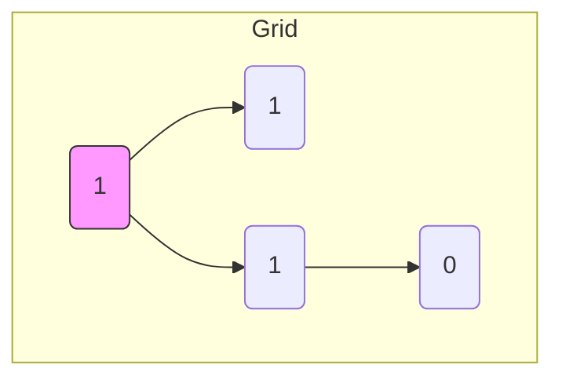

# 🏝️ Graphs: Number of Islands

## 📝 Problem Description
Given an `m x n` 2D binary grid which represents a map of '1's (land) and '0's (water), return the number of islands. An island is surrounded by water and is formed by connecting adjacent lands horizontally or vertically.

!!! info "Real-World Application"
    This is a classic problem in **Computer Vision** (segmenting blobs in a binary image), **Geographical Information Systems (GIS)** (identifying distinct land masses), and **Game Development** (procedural map generation/traversal).

## 🛠️ Constraints & Edge Cases
- $m == grid.length$
- $n == grid[i].length$
- $1 \le m, n \le 300$
- $grid[i][j]$ is '0' or '1'.
- **Edge Cases to Watch:** 
    - Empty grid ($m=0$ or $n=0$).
    - Grid with all water.
    - Grid with one giant island.

---

## 🧠 Approach & Intuition

!!! success "The Aha! Moment"
    Treat the grid as a graph where each '1' is a node. The problem reduces to finding the number of **connected components**. The trick is to "sink" the island (turn '1's into '0's) as you traverse it, so each island is counted exactly once.

### 🐢 Brute Force (Naive)
Searching for every individual '1' and checking its neighbors recursively without marking them as visited would lead to infinite loops or re-counting the same island multiple times, leading to $O(2^{M \times N})$ complexity.

### 🐇 Optimal Approach (DFS/BFS)
1. Iterate through the grid row-by-row.
2. When a '1' is encountered, it indicates a *new* island. Increment `island_count`.
3. Trigger a DFS (or BFS) from that cell to visit all connected '1's and flip them to '0' to mark them as visited.
4. Continue until all cells have been checked.

### 🧩 Visual Tracing


---

## 💻 Solution Implementation

```python
(Implementation details need to be added...)
```

### ⏱️ Complexity Analysis
- **Time Complexity:** $\mathcal{O}(M \times N)$ — Each cell is visited at most twice.
- **Space Complexity:** $\mathcal{O}(M \times N)$ — In the worst case (entire grid is land), the DFS stack stores $M \times N$ calls.

---

## 🎤 Interview Toolkit

- **Harder Variant:** "Number of Distinct Islands" (requires canonical path encoding).
- **Alternative Data Structures:** Union-Find is highly effective for dynamic grids or distributed systems where you process tiles separately.

## 🔗 Related Problems
- `Max Area of Island` — Uses identical traversal.
- `Number of Connected Components in an Undirected Graph` — Pure graph component logic.
