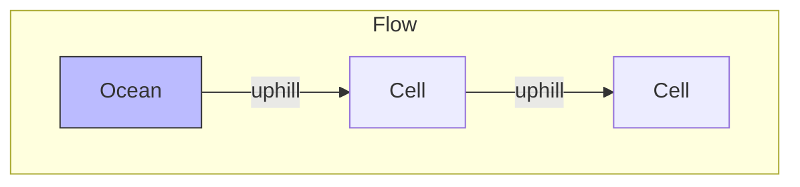

# 🌊 Graphs: Pacific Atlantic Water Flow

## 📝 Problem Description
There is an `m x n` rectangular island that borders both the Pacific and Atlantic oceans. The Pacific Ocean touches the left and top edges, and the Atlantic Ocean touches the right and bottom edges. Water flows to neighboring cells (N, S, E, W) only if the neighboring cell's height is $\le$ the current cell's height. Find all grid coordinates where rain water can flow to both the Pacific AND Atlantic oceans.

!!! info "Real-World Application"
    This is a classic problem in **Hydrology/Geography** (modeling drainage basins) and **Network Routing** (finding nodes reachable from multiple sources in a directed graph).

## 🛠️ Constraints & Edge Cases
- $m == heights.length$
- $n == heights[i].length$
- $1 \le m, n \le 200$
- $0 \le heights[i][j] \le 10^5$
- **Edge Cases to Watch:** 
    - Grid with 1x1 size.
    - Flat islands where all heights are equal.

---

## 🧠 Approach & Intuition

!!! success "The Aha! Moment"
    Instead of asking "Can *this* cell flow to both oceans?" (which requires a search for every cell), reverse the problem: "From the ocean, can we flow *uphill* to this cell?" Run two independent searches starting from the Pacific borders and Atlantic borders respectively, moving to cells with $\ge$ height.

### 🐢 Brute Force (Naive)
Running a DFS for every single cell to check reachability to both oceans results in $\mathcal{O}((M \times N)^2)$ complexity, which will timeout for larger grids.

### 🐇 Optimal Approach
1. Initialize two boolean matrices, `pacific_reachable` and `atlantic_reachable`.
2. DFS from all Pacific border cells (top row, left col) into the island, following non-decreasing paths.
3. DFS from all Atlantic border cells (bottom row, right col) into the island, following non-decreasing paths.
4. Iterate through the grid; any cell marked `True` in both matrices is a valid coordinate.

### 🧩 Visual Tracing


---

## 💻 Solution Implementation

```python
(Implementation details need to be added...)
```

### ⏱️ Complexity Analysis
- **Time Complexity:** $\mathcal{O}(M \times N)$ — We visit each cell at most twice.
- **Space Complexity:** $\mathcal{O}(M \times N)$ — For the two boolean matrices and recursion stack.

---

## 🎤 Interview Toolkit

- **Harder Variant:** "Find nodes in a directed graph reachable from two specific sets of source nodes."
- **Alternative Data Structures:** BFS (Queue-based) is also standard; DFS is often more concise for implementation.

## 🔗 Related Problems
- `Surrounded Regions` — Similar border-based traversal.
- `Rotting Oranges` — Multi-source BFS/DFS pattern.
