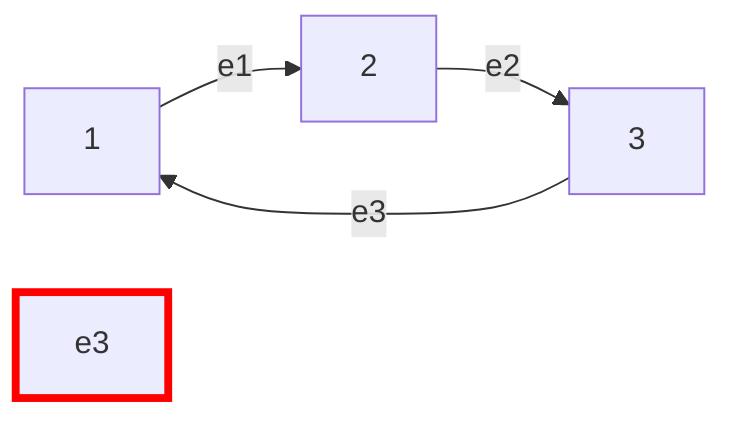

# 🔗 Graphs: Redundant Connection

## 📝 Problem Description
In this problem, a tree is an undirected graph that is connected and has no cycles. You are given a graph that started as a tree with $n$ nodes labeled from $1$ to $n$, with one additional edge added. The added edge has two different vertices chosen from $1$ to $n$. Return an edge that can be removed so that the resulting graph is a tree of $n$ nodes. If there are multiple answers, return the answer that occurs last in the input.

!!! info "Real-World Application"
    Essential for **network topology maintenance** and **dependency management systems** (e.g., detecting circular dependencies in software packages or infrastructure provisioning).

## 🛠️ Constraints & Edge Cases
- $n == edges.length$
- $3 \le n \le 1000$
- Vertices labeled $1 \dots n$.
- **Edge Cases to Watch:** 
    - The graph is already a tree with one cycle.
    - Multiple edges forming cycles.

---

## 🧠 Approach & Intuition

!!! success "The Aha! Moment"
    This is the textbook problem for **Union-Find (Disjoint Set Union)**. A tree has $N$ nodes and $N-1$ edges. Adding one edge creates exactly one cycle. If we use Union-Find to process edges one by one, the *first* edge that connects two nodes already in the same set is the redundant one.

### 🐢 Brute Force (Naive)
Removing each edge one by one and checking if the graph is still connected (using DFS/BFS) takes $\mathcal{O}(N^2)$ time.

### 🐇 Optimal Approach (Union-Find)
1. Initialize a `parent` array for $N$ nodes.
2. Iterate through the edges:
    - For each edge $(u, v)$:
        - `find(u)` and `find(v)` to get their roots.
        - If roots are different: `union(roots)` to merge them.
        - If roots are the same: The nodes are already connected, so this edge closes a cycle. Return $(u, v)$.

### 🧩 Visual Tracing


---

## 💻 Solution Implementation

```python
(Implementation details need to be added...)
```

### ⏱️ Complexity Analysis
- **Time Complexity:** $\mathcal{O}(N \cdot \alpha(N))$ — Where $\alpha$ is the inverse Ackermann function (effectively constant).
- **Space Complexity:** $\mathcal{O}(N)$ — For the parent array.

---

## 🎤 Interview Toolkit

- **Harder Variant:** "Redundant Connection II" (Directed graph version).
- **Alternative Data Structures:** Could use DFS/BFS to find cycles, but Union-Find is significantly more elegant for this specific property.

## 🔗 Related Problems
- `Graph Valid Tree` — Core Union-Find practice.
- `Number of Connected Components` — Union-Find application.
