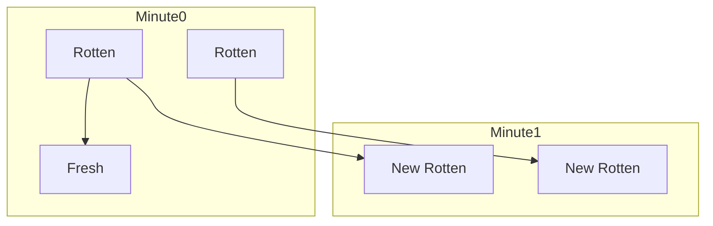

# 🍊 Graph: Rotting Oranges

## 📝 Problem Description
You are given an `m x n` grid where each cell can have one of three values:
- `0`: empty cell,
- `1`: fresh orange,
- `2`: rotten orange.

Every minute, any fresh orange that is 4-directionally adjacent to a rotten orange becomes rotten. Return the minimum number of minutes that must elapse until no cell has a fresh orange. If this is impossible, return `-1`.

!!! info "Real-World Application"
    This algorithm models disease propagation in a population or network virus spread. It is a classic example of **Multi-Source BFS**, used whenever you need to find the minimum time for an influence to spread from multiple initial points across a grid or network.

## 🛠️ Constraints & Edge Cases
- $1 \le m, n \le 10$
- `grid[i][j]` is 0, 1, or 2.
- **Edge Cases to Watch:** 
    - Grid with no fresh oranges (should return 0).
    - Grid where some oranges are unreachable (should return -1).

---

## 🧠 Approach & Intuition

!!! success "The Aha! Moment"
    Don't just run BFS from one rotten orange. Add **all** initially rotten oranges to the queue at the start. This allows you to process the grid level-by-level (minute-by-minute) simultaneously.

### 🐢 Brute Force (Naive)
Repeatedly scanning the entire grid to update all oranges every minute would take $O((MN)^2)$ time, which is inefficient.

### 🐇 Optimal Approach
1. Initialize a queue with coordinates of all initially rotten oranges.
2. Count the total number of fresh oranges.
3. If no fresh oranges exist, return 0.
4. Perform BFS:
   - For each minute, process all oranges currently in the queue.
   - For each rotten orange, check its 4-directional neighbors.
   - If a neighbor is fresh, turn it rotten, decrement fresh count, and add to the queue.
5. After the queue is empty, if the fresh count is 0, return the elapsed minutes; otherwise, return -1.

### 🧩 Visual Tracing


---

## 💻 Solution Implementation

```python
(Implementation details need to be added...)
```

### ⏱️ Complexity Analysis
- **Time Complexity:** $\mathcal{O}(M \times N)$ — We visit each cell at most once.
- **Space Complexity:** $\mathcal{O}(M \times N)$ — In the worst case, the queue can store all cells.

---

## 🎤 Interview Toolkit

- **Harder Variant:** What if some oranges rot at different rates? (Use Dijkstra's instead of BFS).
- **Alternative Data Structures:** Could use a simple list instead of `collections.deque`, but deque is preferred for $O(1)$ pops.

## 🔗 Related Problems
- [Walls and Gates](../walls_and_gates/PROBLEM.md) — Another multi-source BFS problem.
- [Number of Islands](../number_of_islands/PROBLEM.md) — Classic graph connectivity.
