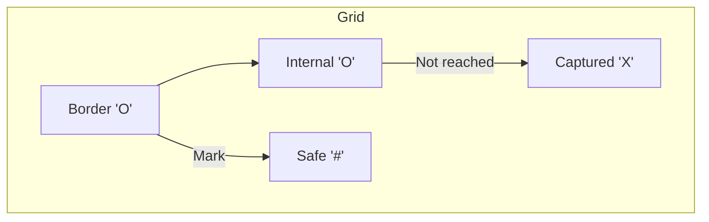

# ❌ Graph: Surrounded Regions

## 📝 Problem Description
Given an `m x n` matrix board containing 'X' and 'O', capture all regions that are 4-directionally surrounded by 'X'. A region is captured by flipping all 'O's into 'X's in that surrounded region.

!!! info "Real-World Application"
    This problem is a foundational exercise in **Boundary Detection** and **Connected Component analysis**, which is used in image processing (e.g., segmenting objects in an image) and geographic information systems (GIS) for identifying bounded land masses.

## 🛠️ Constraints & Edge Cases
- $m, n \ge 1$
- **Edge Cases to Watch:** 
    - Board filled with only 'X's or 'O's.
    - Regions touching the border (should not be captured).

---

## 🧠 Approach & Intuition

!!! success "The Aha! Moment"
    Instead of trying to find the surrounded regions directly, flip the logic: identify all 'O's that are **NOT** surrounded by 'X's (i.e., those connected to the border) and protect them. Once identified, every remaining 'O' is guaranteed to be surrounded.

### 🐢 Brute Force (Naive)
Trying to check every 'O' by BFS/DFS to see if it reaches the boundary is redundant and expensive if done per cell ($O((MN)^2)$).

### 🐇 Optimal Approach
1. Perform a DFS/BFS starting from all 'O's on the border. Mark these as "safe" (e.g., replace with '#').
2. Once the traversal finishes, iterate through the entire board:
   - Any remaining 'O' is surrounded $\to$ flip to 'X'.
   - Any '#' is safe $\to$ flip back to 'O'.

### 🧩 Visual Tracing


---

## 💻 Solution Implementation

```python
(Implementation details need to be added...)
```

### ⏱️ Complexity Analysis
- **Time Complexity:** $\mathcal{O}(M \times N)$ — We traverse each cell a constant number of times.
- **Space Complexity:** $\mathcal{O}(M \times N)$ — In the worst case (e.g., all 'O's), the recursion stack for DFS takes this much space.

---

## 🎤 Interview Toolkit

- **Harder Variant:** What if you need to use Union-Find instead of DFS/BFS? (Identify border nodes as part of a single "safe" set).
- **Alternative Data Structures:** BFS is generally preferred for very deep recursions to avoid stack overflow.

## 🔗 Related Problems
- [Pacific Atlantic Water Flow](../pacific_atlantic_water_flow/PROBLEM.md) — Another border-based DFS problem.
- [Number of Islands](../number_of_islands/PROBLEM.md) — Similar connectivity logic.
