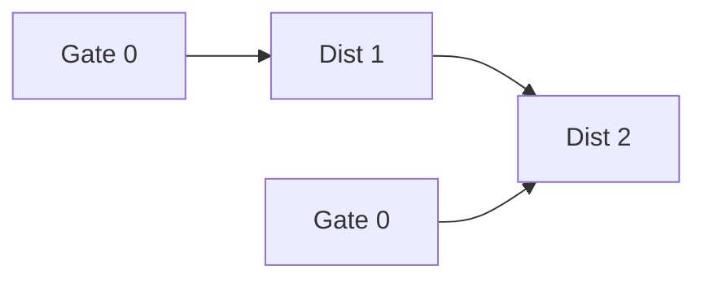

# 🏰 Graph: Walls and Gates

## 📝 Problem Description
You are given a $m \times n$ 2D grid initialized with these three possible values:
- `-1`: A wall or an obstacle.
- `0`: A gate.
- `INF` ($2^{31}-1$): Empty room.

Fill each empty room with the distance to its nearest gate. If it is impossible to reach a gate, it should remain `INF`.

!!! info "Real-World Application"
    Used in game development for pathfinding, specifically to calculate distance fields or visibility maps, helping NPCs quickly determine the nearest safe zone (gate) from their current position.

## 🛠️ Constraints & Edge Cases
- $m, n \ge 1$
- **Edge Cases to Watch:** 
    - Grid with no gates (all rooms stay INF).
    - Grid with no rooms (all walls or gates).

---

## 🧠 Approach & Intuition

!!! success "The Aha! Moment"
    Instead of running BFS for every single room (which would be $O((MN)^2)$), run a **Multi-Source BFS** starting from all gates simultaneously. The first time a room is visited, it is guaranteed to be via the shortest path.

### 🐢 Brute Force (Naive)
Running DFS/BFS starting from every single empty room to find the closest gate is computationally expensive, leading to TLE.

### 🐇 Optimal Approach
1. Initialize a queue and add all gate coordinates `(r, c)` where `rooms[r][c] == 0`.
2. Perform BFS from all gates:
   - Pop a cell `(r, c)`.
   - For each of its 4 neighbors, if the neighbor is an empty room (`INF`):
     - Update its distance: `rooms[nr][nc] = rooms[r][c] + 1`.
     - Add `(nr, nc)` to the queue.
3. Once the queue is empty, all reachable rooms will have the shortest distance.

### 🧩 Visual Tracing


---

## 💻 Solution Implementation

```python
(Implementation details need to be added...)
```

### ⏱️ Complexity Analysis
- **Time Complexity:** $\mathcal{O}(M \times N)$ — Each cell is added to the queue at most once.
- **Space Complexity:** $\mathcal{O}(M \times N)$ — Queue storage for BFS.

---

## 🎤 Interview Toolkit

- **Harder Variant:** What if you need to account for varying costs to move through different terrain? (Use Dijkstra's algorithm).
- **Alternative Data Structures:** The queue is essential for BFS level-order traversal.

## 🔗 Related Problems
- [Rotting Oranges](../rotting_oranges/PROBLEM.md) — Another multi-source BFS problem.
- [Shortest Path in Binary Matrix](../../05_binary_search/search_2d_matrix/PROBLEM.md) — Finding shortest paths.
