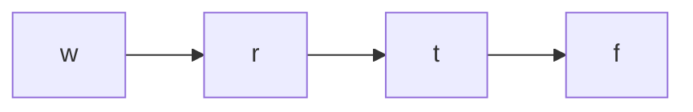

# 👽 Advanced Graph: Alien Dictionary

## 📝 Problem Description
There is a new alien language that uses the English alphabet. However, the order among the letters is unknown to you. You are given a list of strings `words` from the alien language's dictionary, where the strings in `words` are sorted lexicographically by the rules of this new language. Return a string of the unique letters in the new alien language sorted in lexicographically increasing order by the new language's rules. If there is no solution, return "". If there are multiple solutions, return any of them.

!!! info "Real-World Application"
    Dependency resolution in build systems (like Maven or npm) and topological task ordering.

## 🛠️ Constraints & Edge Cases
- $1 \le words.length \le 100$
- $1 \le words[i].length \le 100$
- **Edge Cases to Watch:** 
    - Empty inputs.
    - Invalid lexicographical order (e.g., "abc" before "ab").
    - Cycles in character dependencies.

---

## 🧠 Approach & Intuition

!!! success "The Aha! Moment"
    The problem is a variation of finding a topological order in a directed graph where edges are defined by character precedence derived from adjacent words.

### 🐢 Brute Force (Naive)
Trying all permutations of the alphabet characters is $\mathcal{O}(N! \cdot L)$, where $N$ is the number of unique characters and $L$ is the word length. This is infeasible for large alphabets.

### 🐇 Optimal Approach
1.  **Construct Graph:** Compare adjacent words to find the first differing character. Add a directed edge from the character in the first word to the character in the second word.
2.  **Handle Invalid Prefix:** If a longer word appears before a shorter prefix (e.g., "abc" before "ab"), the dictionary is invalid.
3.  **Topological Sort:** Use Kahn's algorithm (BFS) with indegree counts to process nodes with zero dependencies.
4.  **Detect Cycles:** If the final order doesn't include all unique characters, a cycle exists (return "").

### 🧩 Visual Tracing


---

## 💻 Solution Implementation

```python
(Implementation details need to be added...)
```

### ⏱️ Complexity Analysis
- **Time Complexity:** $\mathcal{O}(C)$ where $C$ is the total number of characters in all words.
- **Space Complexity:** $\mathcal{O}(1)$ (or $\mathcal{O}(U + E)$ where $U$ is unique characters, capped at 26).

---

## 🎤 Interview Toolkit

- **Harder Variant:** What if the input is a massive stream of words?
- **Alternative Data Structures:** Could DFS be used for topological sort? Yes, but tracking cycles requires three states (unvisited, visiting, visited).

## 🔗 Related Problems
- `[Course Schedule](../course_schedule/PROBLEM.md)` — Fundamental Topological Sort
