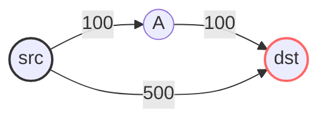

# ✈️ Advanced Graph: Cheapest Flights Within K Stops

## 📝 Problem Description
There are `n` cities connected by some number of flights. You are given an array `flights` where `flights[i] = [from_i, to_i, price_i]` indicates that there is a flight from city `from_i` to city `to_i` with cost `price_i`. You are also given three integers `src`, `dst`, and `k`, return the cheapest price from `src` to `dst` with at most `k` stops. If there is no such route, return `-1`.

!!! info "Real-World Application"
    This problem models network routing under constraints, such as finding the most cost-effective path for data packets where the number of hops (routers) must be limited to prevent excessive latency.

## 🛠️ Constraints & Edge Cases
- $1 \le n \le 100$
- $0 \le flights.length \le n \cdot (n - 1) / 2$
- $0 \le src, dst < n$
- $0 \le k < n$
- **Edge Cases:** 
    - `src == dst` (cost is 0).
    - No possible path (return -1).
    - `k=0` (direct flight only).

---

## 🧠 Approach & Intuition

!!! success "The Aha! Moment"
    Standard Dijkstra's algorithm tracks only the `cost`. To satisfy the `k` stops constraint, we must track the state as `(cost, node, stops_remaining)` in our Priority Queue.

### 🐢 Brute Force (Naive)
Using pure DFS, we explore all paths from `src` to `dst`. This has exponential complexity $O(V^V)$ as we revisit nodes, leading to TLE.

### 🐇 Optimal Approach (Dijkstra Variant)
1. Use a Priority Queue to store `(cost, current_node, stops_remaining)`.
2. Keep a `visited` dictionary mapping nodes to the maximum `stops_remaining` with which we have reached them.
3. Only push to the queue if we reach a node with more remaining stops than previously recorded.

### 🧩 Visual Tracing


---

## 💻 Solution Implementation

```python
(Implementation details need to be added...)
```

### ⏱️ Complexity Analysis
- **Time Complexity:** $O(E \cdot K \log (V \cdot K))$, where $E$ is the number of edges, $V$ the number of cities, and $K$ the stop constraint.
- **Space Complexity:** $O(V \cdot K)$ to store the visited states in the queue.

---

## 🎤 Interview Toolkit

- **Harder Variant:** What if we need the *shortest* path in terms of time instead of cost?
- **Alternative Data Structures:** Bellman-Ford can also solve this in $O(K \cdot E)$ without a priority queue.

## 🔗 Related Problems
- [Network Delay Time](../network_delay_time/PROBLEM.md)
- [Swim in Rising Water](../swim_in_rising_water/PROBLEM.md)
