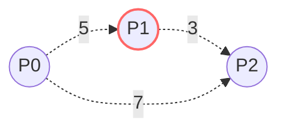

# 🏗️ Advanced Graph: Min Cost to Connect All Points

## 📝 Problem Description
You are given an array `points` representing integer coordinates of some points on a 2D-plane, where `points[i] = [xi, yi]`. The cost of connecting two points `[xi, yi]` and `[xj, yj]` is the manhattan distance between them: `|xi - xj| + |yi - yj|`. Return the minimum cost to make all points connected.

!!! info "Real-World Application"
    This problem is a classic example of constructing a Minimum Spanning Tree (MST). It is foundational in network design, such as laying cables between buildings or optimizing infrastructure routes to minimize total construction costs.

## 🛠️ Constraints & Edge Cases
- $1 \le points.length \le 1000$
- $-10^6 \le xi, yi \le 10^6$
- **Edge Cases:** 
    - A single point (cost is 0).
    - Points with identical coordinates.

---

## 🧠 Approach & Intuition

!!! success "The Aha! Moment"
    Connecting all points with minimum cost is equivalent to finding the Minimum Spanning Tree (MST) of a complete graph where edges are Manhattan distances.

### 🐢 Brute Force (Naive)
Generating all possible spanning trees and selecting the minimum is $O(N^{N-2})$ via Cayley's formula, which is intractable.

### 🐇 Optimal Approach (Prim's Algorithm)
1. Treat the points as a graph where every pair is connected.
2. Use Prim's algorithm with a Min-Heap to greedily select the shortest edge that connects a new point to the existing tree.
3. Start from an arbitrary point, maintain a set of visited points, and expand until all points are connected.

### 🧩 Visual Tracing


---

## 💻 Solution Implementation

```python
(Implementation details need to be added...)
```

### ⏱️ Complexity Analysis
- **Time Complexity:** $O(N^2 \log N)$ if using a priority queue, or $O(N^2)$ with a simple array-based Prim's implementation.
- **Space Complexity:** $O(N^2)$ to store the graph (or $O(N)$ if calculating edges on-the-fly).

---

## 🎤 Interview Toolkit

- **Harder Variant:** What if the cost function changes (e.g., Euclidean distance)?
- **Alternative Data Structures:** Kruskal's algorithm (using DSU) is another valid approach.

## 🔗 Related Problems
- [Cheapest Flights Within K Stops](../cheapest_flights_within_k_stops/PROBLEM.md)
- [Swim in Rising Water](../swim_in_rising_water/PROBLEM.md)
