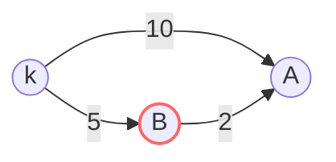

# 🌐 Advanced Graph: Network Delay Time

## 📝 Problem Description
You are given a network of `n` nodes, labeled from `1` to `n`. You are also given `times`, a list of travel times as directed edges `times[i] = (u, v, w)`, where `u` is the source node, `v` is the target node, and `w` is the time it takes for a signal to travel from source to target. We will send a signal from a given node `k`. Return the minimum time it takes for all the `n` nodes to receive the signal. If it is impossible for all the `n` nodes to receive the signal, return `-1`.

!!! info "Real-World Application"
    This problem simulates latency in distributed networks. Finding the network delay time is equivalent to calculating the time taken for a broadcast signal to reach all endpoints in a computer network (e.g., multicast).

## 🛠️ Constraints & Edge Cases
- $1 \le k \le n \le 100$
- $1 \le times.length \le 6000$
- **Edge Cases:**
    - Disconnected graph (return -1).
    - `k` is the only node ($n=1$, time is 0).

---

## 🧠 Approach & Intuition

!!! success "The Aha! Moment"
    The problem asks for the maximum of the shortest path times from source node `k` to all other nodes. This is a classic application of Dijkstra's algorithm.

### 🐢 Brute Force (Naive)
Using Bellman-Ford or exhaustive path searching would be $O(V \cdot E)$, which is slow for larger graphs, though feasible for $N=100$.

### 🐇 Optimal Approach (Dijkstra)
1. Build an adjacency list.
2. Use a Priority Queue (min-heap) to greedily visit nodes with the smallest cumulative time.
3. Keep track of the minimum time found to reach each node.
4. After processing, if the number of visited nodes equals $n$, return the max time among all node visit times. Otherwise, return -1.

### 🧩 Visual Tracing


---

## 💻 Solution Implementation

```python
(Implementation details need to be added...)
```

### ⏱️ Complexity Analysis
- **Time Complexity:** $O(E \log V)$, where $E$ is the number of edges and $V$ is the number of nodes.
- **Space Complexity:** $O(V + E)$ to store the adjacency list and priority queue.

---

## 🎤 Interview Toolkit

- **Harder Variant:** What if the graph has negative edge weights? (Use Bellman-Ford or SPFA).
- **Alternative Data Structures:** For sparse graphs, a simple list-based approach might be faster than Dijkstra.

## 🔗 Related Problems
- [Cheapest Flights Within K Stops](../cheapest_flights_within_k_stops/PROBLEM.md)
- [Swim in Rising Water](../swim_in_rising_water/PROBLEM.md)
