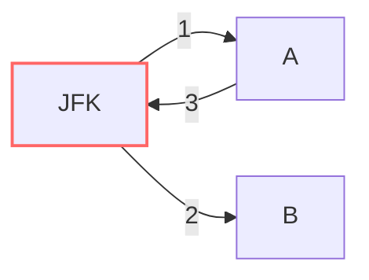

# 🗺️ Advanced Graph: Reconstruct Itinerary

## 📝 Problem Description
You are given a list of airline `tickets` where `tickets[i] = [from_i, to_i]` represent the departure and arrival airports of one flight. Reconstruct the itinerary in order and return it. All of the tickets belong to a man who departs from "JFK", thus the itinerary must begin with "JFK". If there are multiple valid itineraries, you should return the itinerary that has the smallest lexical order when read as a single string.

!!! info "Real-World Application"
    Finding a route that visits every edge in a graph exactly once is the definition of an **Eulerian Path**. This is useful in logistics, network routing, and circuit testing (e.g., ensuring a robotic arm visits all necessary connections).

## 🛠️ Constraints & Edge Cases
- $1 \le tickets.length \le 300$
- $tickets[i].length == 2$
- **Edge Cases:**
    - Disconnected graph (all tickets are assumed to form a valid component starting at JFK).
    - Circular itineraries.

---

## 🧠 Approach & Intuition

!!! success "The Aha! Moment"
    This is an Eulerian Path problem. Since we must visit *every* ticket exactly once, Hierholzer's Algorithm (DFS variant) is the optimal approach. By sorting departures lexicographically and traversing the path, we ensure lexical minimality by always visiting the smallest next destination.

### 🐢 Brute Force (Naive)
Recursive backtracking trying all possible paths will explore paths of length $N$, leading to $O(N!)$ in worst-case branching scenarios.

### 🐇 Optimal Approach (Hierholzer's Algorithm)
1. Store flight graph in an adjacency list with sorted destinations (descending order so we can `pop()` the smallest).
2. Start DFS from "JFK".
3. Traverse until a node has no outgoing edges, then add it to the result list.
4. The itinerary will be the result list in reverse order.

### 🧩 Visual Tracing


---

## 💻 Solution Implementation

```python
(Implementation details need to be added...)
```

### ⏱️ Complexity Analysis
- **Time Complexity:** $O(E \log E)$, where $E$ is the number of tickets, due to sorting the adjacency lists.
- **Space Complexity:** $O(V + E)$ to store the graph and the recursion stack.

---

## 🎤 Interview Toolkit

- **Harder Variant:** What if the graph doesn't have an Eulerian path?
- **Alternative Data Structures:** Can we solve this iteratively to avoid stack overflow? (Yes, by using an explicit stack).

## 🔗 Related Problems
- [Network Delay Time](../network_delay_time/PROBLEM.md)
- [Cheapest Flights Within K Stops](../cheapest_flights_within_k_stops/PROBLEM.md)
