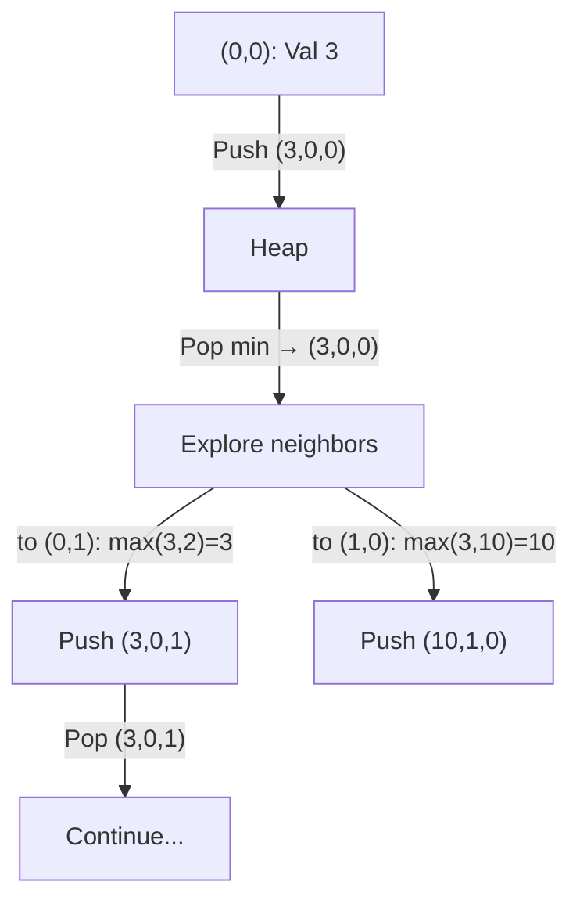
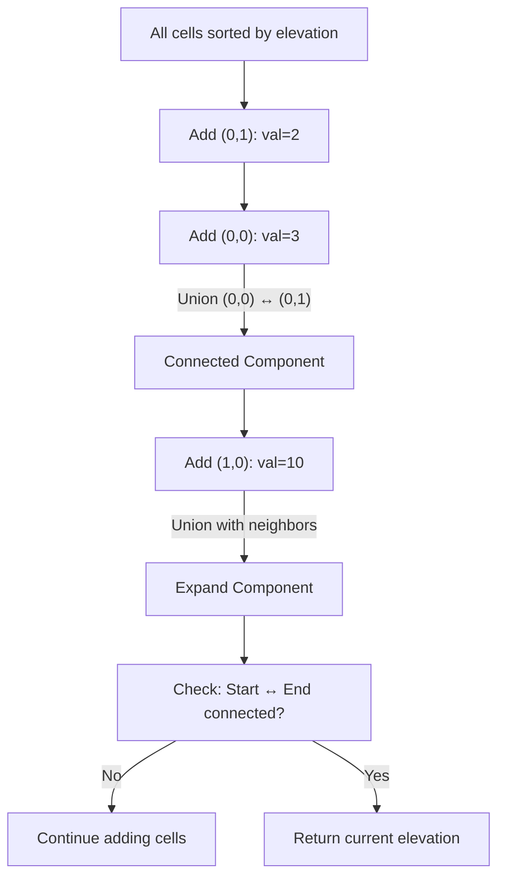

# 🏊 Advanced Graph: Swim in Rising Water

## 📝 Description
[LeetCode 778](https://leetcode.com/problems/swim-in-rising-water/)
You are given an `n x n` integer matrix `grid` where each value `grid[i][j]` represents the elevation at that point `(i, j)`. The rain starts to fall. At time `t`, the depth of the water everywhere is `t`. You can swim from a square to another 4-directionally adjacent square if and only if the elevation of both squares individually are at most `t`. You can swim infinite distances in zero time. Return the least time until you can reach the bottom right square `(n - 1, n - 1)` if you start at the top left square `(0, 0)`.

!!! info "Real-World Application"
    This models **Pathfinding with Bottleneck Constraints**, such as finding a route for a vehicle that can only traverse terrain below a certain height, or network routing where links have varying bandwidths and you need the path with the best "minimum bandwidth".

## 🛠️ Constraints & Edge Cases
- $n \le 50$
- $0 \le grid[i][j] < n^2$
- **Edge Cases to Watch:**
    - `n=1` (Time is just `grid[0][0]`).
    - Start or End points have high elevation.

---

## 🧠 Approach & Intuition

!!! success "The Aha! Moment"
    This isn't just "shortest path" (fewest steps). It's a **minimax path** problem — the goal is to **minimize the maximum elevation** along a path from top-left to bottom-right.

```
Two standard approaches:
```

---

### 🐢 Brute Force (Naive)

Binary search on the answer `T`. For a fixed `T`, run BFS/DFS to check if a path exists where all visited cells ≤ `T`.

* **Time Complexity:** $O(N^2 \log (\text{max_elevation}))$
* **Space Complexity:** $O(N^2)$
* Works, but often slower and less elegant than Dijkstra or Union-Find.

---

### 🐇 Optimal Approach 1: Dijkstra (Min-Heap)

1. Maintain a **min-heap** storing `(time, r, c)` — `time` is the water level needed to reach `(r,c)`.
2. Start: push `(grid[0][0], 0, 0)` and mark `(0,0)` visited.
3. While heap is not empty:

   * Pop `(t, r, c)`.
   * If `(r, c) == (N-1, N-1)`, **return `t`**.
   * For each 4-directional neighbor `(nr, nc)`:

     * `new_t = max(t, grid[nr][nc])`
     * If `(nr, nc)` not visited, push `(new_t, nr, nc)` and mark visited.

**Mermaid diagram for Dijkstra:**



---

### 🐇 Optimal Approach 2: Union-Find (Kruskal-style)

1. **Sort all cells by elevation**.
2. Initialize each cell as its own component.
3. Iterate over cells in increasing elevation:

   * For each cell, **union it with adjacent cells** that are already “added”.
   * After each union, **check if `(0,0)` is connected to `(N-1,N-1)`**.
4. First elevation when start and end are connected = **minimum required time**.

**Mermaid diagram for Union-Find:**



---

## 💻 Solution Implementation

```python
(Implementation details need to be added...)
```

---

### ⏱️ Complexity Analysis

| Approach   | Time                                                  | Space                         |
| ---------- | ----------------------------------------------------- | ----------------------------- |
| Dijkstra   | $O(N^2 \log N)$ — heap operations for all $N^2$ cells | $O(N^2)$ — visited set + heap |
| Union-Find | $O(N^2 \log N)$ — sorting + union-find operations     | $O(N^2)$ — parent/size arrays |

---

### 🎤 Interview Toolkit

* **Dijkstra:** More intuitive; easy to implement using a min-heap. Good if you want step-by-step path exploration.
* **Union-Find:** Conceptually elegant; “flood-fill” approach. Often faster in practice for dense grids.
* Both approaches are correct; highlighting both demonstrates deep understanding.

---

## 🔗 Related Problems
- [Network Delay Time](../network_delay_time/PROBLEM.md) — Standard Dijkstra
<!-- * [Minimum Spanning Tree / Kruskal](../mst/PROBLEM.md) — Union-Find paradigm -->
