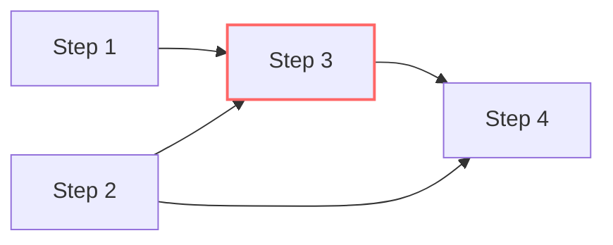

# 🪜 Dynamic Programming: Climbing Stairs

## 📝 Problem Description
You are climbing a staircase. It takes `n` steps to reach the top. Each time you can either climb 1 or 2 steps. In how many distinct ways can you climb to the top?

!!! info "Real-World Application"
    This problem is a fundamental introduction to dynamic programming, used in resource allocation, inventory management, and pathfinding where decision points have local dependencies.

## 🛠️ Constraints & Edge Cases
- $1 \le n \le 45$
- **Edge Cases to Watch:** 
    - $n=1$ (1 way)
    - $n=2$ (2 ways)

---

## 🧠 Approach & Intuition

!!! success "The Aha! Moment"
    To reach step $N$, you must have come from either $N-1$ or $N-2$. This defines the recurrence: $ways(N) = ways(N-1) + ways(N-2)$, which is the Fibonacci sequence.

### 🐢 Brute Force (Naive)
Using simple recursion, $ways(N) = ways(N-1) + ways(N-2)$. This results in a tree of height $N$, leading to $\mathcal{O}(2^N)$ time complexity due to redundant calculations.

### 🐇 Optimal Approach
We can use dynamic programming to store previously calculated values. Since we only need the results of the last two steps, we can optimize space to $\mathcal{O}(1)$.
1. Initialize `a = 1` (ways to reach step 1), `b = 2` (ways to reach step 2).
2. For $i$ from 3 to $N$, update $ways = a + b$, then shift $a = b$ and $b = ways$.

### 🧩 Visual Tracing


---

## 💻 Solution Implementation

```python
(Implementation details need to be added...)
```

### ⏱️ Complexity Analysis
- **Time Complexity:** $\mathcal{O}(N)$ — We iterate from 3 to $N$ exactly once.
- **Space Complexity:** $\mathcal{O}(1)$ — We only use a few variables to store the previous two step counts.

---

## 🎤 Interview Toolkit

- **Harder Variant:** What if you can take up to $K$ steps at a time, or some stairs are "broken"?
- **Alternative:** Can you solve this in $\mathcal{O}(\log N)$ time using matrix exponentiation?

## 🔗 Related Problems
- [Min Cost Climbing Stairs](../min_cost_climbing_stairs/PROBLEM.md)
<!-- - [Fibonacci Number](../fibonacci_number/PROBLEM.md) -->
