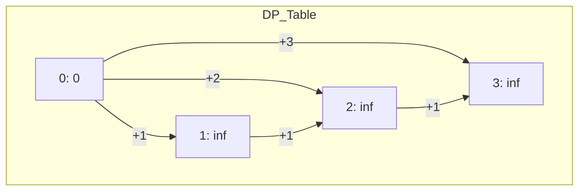

# 💰 Dynamic Programming: Coin Change

## 📝 Problem Description
You are given an integer array `coins` representing coins of different denominations and an integer `amount` representing a total amount of money. Return the fewest number of coins that you need to make up that amount. If that amount of money cannot be made up by any combination of the coins, return `-1`.

!!! info "Real-World Application"
    This is a variation of the Unbounded Knapsack problem, widely used in financial systems, currency exchange, and resource allocation where you need to reach a target with minimal units.

## 🛠️ Constraints & Edge Cases
- $1 \le \text{coins.length} \le 12$
- $1 \le \text{coins[i]} \le 2^{31}-1$
- $0 \le \text{amount} \le 10^4$
- **Edge Cases to Watch:** 
    - `amount` is 0 (Return 0)
    - No possible combination (Return -1)

---

## 🧠 Approach & Intuition

!!! success "The Aha! Moment"
    Don't use a greedy approach (e.g., picking the largest coin first). Instead, realize that for any amount `A`, the optimal answer is `1 + min(dp[A - coin])` for all `coin` in `coins`.

### 🐢 Brute Force (Naive)
Using recursion, we try every possible combination of coins. This leads to an exponential number of paths, resulting in $\mathcal{O}(S^n)$ where $S$ is the amount and $n$ is the number of coin types.

### 🐇 Optimal Approach (Tabulation)
We use a bottom-up DP table where `dp[i]` represents the minimum coins for amount `i`.
1. Initialize `dp` of size `amount + 1` with `infinity`, and `dp[0] = 0`.
2. Iterate `a` from 1 to `amount`:
    - For each `c` in `coins`: if `a - c >= 0`, `dp[a] = min(dp[a], 1 + dp[a - c])`.
3. If `dp[amount]` is still `infinity`, return -1.

### 🧩 Visual Tracing


---

## 💻 Solution Implementation

```python
(Implementation details need to be added...)
```

### ⏱️ Complexity Analysis
- **Time Complexity:** $\mathcal{O}(\text{amount} \times \text{coins.length})$ — We compute values for each amount up to `amount` and iterate through all coins for each.
- **Space Complexity:** $\mathcal{O}(\text{amount})$ — We store the minimum coins needed for each amount from 0 to `amount`.

---

## 🎤 Interview Toolkit

- **Harder Variant:** Can you return *all* combinations of coins that form the amount?
- **Optimization:** If coins were infinite, could this be solved with BFS?

## 🔗 Related Problems
<!-- - [Combination Sum IV](../../14_2d_dynamic_programming/combination_sum_iv/PROBLEM.md) -->
<!-- - [Perfect Squares](../perfect_squares/PROBLEM.md) -->
