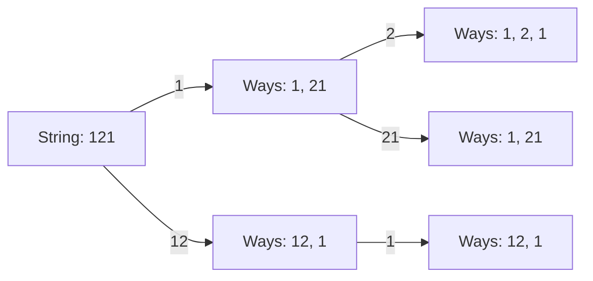

# 🧩 Dynamic Programming: Decode Ways

## 📝 Problem Description
A message containing letters from A-Z can be encoded into numbers using the mapping: 'A' -> "1", 'B' -> "2", ..., 'Z' -> "26". Given a string `s` containing only digits, return the number of ways to decode it.

!!! info "Real-World Application"
    This problem relates to parsing and ambiguity resolution in data streams. It is a foundational DP pattern for handling sequential dependencies with overlapping sub-choices, similar to how parsers interpret byte streams.

## 🛠️ Constraints & Edge Cases
- $1 \le s.length \le 100$
- $s$ contains only digits.
- **Edge Cases to Watch:** 
    - String starting with '0' (Invalid).
    - Consecutive zeros (e.g., "100") (Invalid).

---

## 🧠 Approach & Intuition

!!! success "The Aha! Moment"
    A character can be decoded as a single digit (if '1'-'9') or a two-digit number (if '10'-'26'). This creates overlapping subproblems where the number of ways to decode `s[i:]` depends on the ways to decode `s[i+1:]` and `s[i+2:]`.

### 🐢 Brute Force (Naive)
Recursive branching at each step leads to $\mathcal{O}(2^N)$ time complexity, as many decoding paths for the same substring are re-calculated repeatedly.

### 🐇 Optimal Approach (Tabulation)
We use a DP array `dp[i]` where `dp[i]` is the number of ways to decode the prefix of length `i`.
1. Initialize `dp[0] = 1` (base case for empty string).
2. For each index `i` from 1 to `n`:
    - Add `dp[i-1]` if `s[i-1]` is valid ('1'-'9').
    - Add `dp[i-2]` if the two-digit number `s[i-2:i]` is in ['10', '26'].

### 🧩 Visual Tracing


---

## 💻 Solution Implementation

```python
(Implementation details need to be added...)
```

### ⏱️ Complexity Analysis
- **Time Complexity:** $\mathcal{O}(N)$ — We traverse the string once.
- **Space Complexity:** $\mathcal{O}(N)$ — To store the DP table (can be optimized to $\mathcal{O}(1)$).

---

## 🎤 Interview Toolkit

- **Harder Variant:** What if the mapping includes different characters?
- **Optimization:** Can this be solved with space optimization to $\mathcal{O}(1)$ since only the last two states matter?

## 🔗 Related Problems
- [Climbing Stairs](../climbing_stairs/PROBLEM.md)
