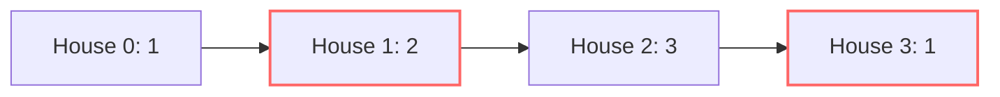

# 🏠 DP: House Robber

## 📝 Problem Description
You are a professional robber planning to rob houses along a street. Each house has a certain amount of money stashed, the only constraint stopping you from robbing each of them is that adjacent houses have security systems connected and it will automatically contact the police if two adjacent houses were broken into on the same night. Given an integer array `nums` representing the amount of money of each house, return the maximum amount of money you can rob tonight without alerting the police.

!!! info "Real-World Application"
    This problem is a fundamental introduction to resource allocation under constraints. Similar logic is used in signal processing to maximize non-adjacent signal strength and in scheduling tasks on limited hardware to avoid interference.

## 🛠️ Constraints & Edge Cases
- $1 \le \text{nums.length} \le 100$
- $0 \le \text{nums}[i] \le 400$
- **Edge Cases to Watch:** 
    - Empty array (return 0)
    - Single house (return the value)
    - Two houses (return the max of the two)

---

## 🧠 Approach & Intuition

!!! success "The Aha! Moment"
    The key insight is recognizing that for any house $i$, the maximum loot is either the loot from house $i-1$ (skipping house $i$) or the loot from house $i-2$ plus the value of house $i$ (robbing house $i$).

### 🐢 Brute Force (Naive)
At each house, we decide to rob or skip. This creates a binary decision tree of depth $N$, resulting in $\mathcal{O}(2^N)$ time complexity, which is impractical for $N > 20$.

### 🐇 Optimal Approach
We maintain two state variables: `rob1` (max money up to $i-2$) and `rob2` (max money up to $i-1$). For each new house value $n$, the new maximum is `max(n + rob1, rob2)`.

### 🧩 Visual Tracing


---

## 💻 Solution Implementation

```python
(Implementation details need to be added...)
```

### ⏱️ Complexity Analysis
- **Time Complexity:** $\mathcal{O}(N)$ — We traverse the list exactly once.
- **Space Complexity:** $\mathcal{O}(1)$ — We only store two integer variables regardless of input size.

---

## 🎤 Interview Toolkit

- **Harder Variant:** House Robber II (circular street), where the first and last houses are adjacent.
- **Alternative Data Structures:** Can be solved with Top-Down recursion with memoization (storing intermediate values in a dictionary/array).

## 🔗 Related Problems
- [House Robber II](../house_robber_ii/PROBLEM.md) — Circular version of this problem.
- [Min Cost Climbing Stairs](../min_cost_climbing_stairs/PROBLEM.md) — Another fundamental linear DP.
