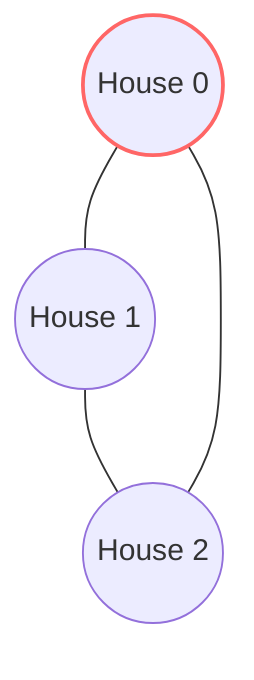

# 🏠 DP: House Robber II

## 📝 Problem Description
You are a professional robber planning to rob houses along a street. Each house has a certain amount of money stashed. This place has security systems connected, and all houses at this place are arranged in a circle. That means the first house is the neighbor of the last one. Meanwhile, the security system for two adjacent houses will automatically contact the police if two adjacent houses were broken into on the same night. Given an integer array `nums` representing the amount of money of each house, return the maximum amount of money you can rob tonight without alerting the police.

!!! info "Real-World Application"
    This circular dependency constraint appears in network topology management and ring-buffer task scheduling where wrap-around interference must be prevented.

## 🛠️ Constraints & Edge Cases
- $1 \le \text{nums.length} \le 100$
- $0 \le \text{nums}[i] \le 1000$
- **Edge Cases to Watch:** 
    - Empty array (return 0)
    - Single house (return the value)
    - Two houses (return the max of the two)

---

## 🧠 Approach & Intuition

!!! success "The Aha! Moment"
    Since the houses are in a circle, the first and last cannot be robbed together. Therefore, the problem reduces to solving the linear "House Robber" problem twice: once for the range `[0, N-2]` (excluding the last) and once for `[1, N-1]` (excluding the first).

### 🐢 Brute Force (Naive)
A naive approach would check all valid subsets of non-adjacent houses in a circular fashion, resulting in $\mathcal{O}(2^N)$ time complexity.

### 🐇 Optimal Approach
Use the optimal linear solution (`rob1`, `rob2` state tracking) on the two slices of the array and take the maximum result of those two.

### 🧩 Visual Tracing


---

## 💻 Solution Implementation

```python
(Implementation details need to be added...)
```

### ⏱️ Complexity Analysis
- **Time Complexity:** $\mathcal{O}(N)$ — We perform two passes, each taking linear time.
- **Space Complexity:** $\mathcal{O}(1)$ — We use a constant amount of extra space beyond input storage.

---

## 🎤 Interview Toolkit

- **Harder Variant:** What if the circular constraint involves dynamic adding/removing of houses? Requires segment trees or similar advanced structures.
- **Alternative Data Structures:** The logic is essentially a reuse of the linear sub-problem; the focus is on mastering the slicing logic.

## 🔗 Related Problems
- [House Robber](../house_robber/PROBLEM.md) — Fundamental linear version.
- [Maximum Product Subarray](../maximum_product_subarray/PROBLEM.md) — Another array-based optimization problem.
