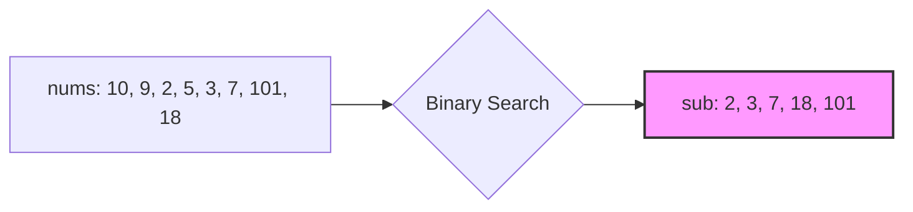

# 📈 DP: Longest Increasing Subsequence

## 📝 Problem Description
Given an integer array `nums`, return the length of the longest strictly increasing subsequence. A subsequence is a sequence that can be derived from an array by deleting some or no elements without changing the order of the remaining elements.

!!! info "Real-World Application"
    This problem is widely used in version control systems to find the difference between two files, as well as in algorithmic trading to identify long-term trends in price data.

## 🛠️ Constraints & Edge Cases
- $1 \le \text{nums.length} \le 2500$
- $-10^4 \le \text{nums}[i] \le 10^4$
- **Edge Cases to Watch:** 
    - Empty array (return 0)
    - Array with one element (return 1)
    - Strictly decreasing array (return 1)

---

## 🧠 Approach & Intuition

!!! success "The Aha! Moment"
    Instead of standard DP, we can maintain a "tail" list where `tails[i]` is the smallest tail of all increasing subsequences of length `i+1`. We can use binary search to efficiently update this list.

### 🐢 Brute Force (Naive)
Generating all $2^N$ subsequences and checking if they are increasing is $\mathcal{O}(2^N)$. A standard DP approach (`dp[i]` = length of LIS ending at `i`) is $\mathcal{O}(N^2)$.

### 🐇 Optimal Approach
Maintain a `sub` list where we keep track of the potential LIS. For each element, either append it to `sub` (if it's larger than the last element) or replace the smallest element in `sub` that is $\ge$ current element using binary search. This ensures `sub` is sorted and maintains the potential for the longest sequence.

### 🧩 Visual Tracing


---

## 💻 Solution Implementation

```python
(Implementation details need to be added...)
```

### ⏱️ Complexity Analysis
- **Time Complexity:** $\mathcal{O}(N \log N)$ — We iterate through $N$ elements and perform binary search ($\log N$) for each.
- **Space Complexity:** $\mathcal{O}(N)$ — To store the `sub` list.

---

## 🎤 Interview Toolkit

- **Harder Variant:** Longest Increasing Subsequence in $\mathcal{O}(N \log N)$ is often expected. Also, reconstruct the actual sequence, not just the length.
- **Alternative Data Structures:** Fenwick Tree or Segment Tree can also achieve $\mathcal{O}(N \log N)$ if the range of values is constrained.

## 🔗 Related Problems
- [Longest Palindromic Substring](../longest_palindromic_substring/PROBLEM.md) — Another classic sequence problem.
- [Longest Common Subsequence](../../14_2d_dynamic_programming/longest_common_subsequence/PROBLEM.md) — Related sequence optimization.
