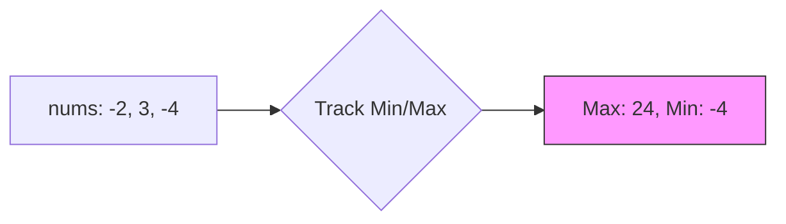

# 📈 DP: Maximum Product Subarray

## 📝 Problem Description
Given an integer array `nums`, find a contiguous non-empty subarray within the array that has the largest product, and return the product. It is guaranteed that the answer will fit in a 32-bit integer.

!!! info "Real-World Application"
    Similar to the maximum sum subarray (Kadane's algorithm), this is used in financial modeling to identify high-growth periods in volatile data series where negative factors (e.g., losses) must be considered.

## 🛠️ Constraints & Edge Cases
- $1 \le \text{nums.length} \le 2 \times 10^4$
- $-10 \le \text{nums}[i] \le 10$
- **Edge Cases to Watch:** 
    - Array with zeros (breaks product chains)
    - Array with negative numbers (flipping signs)
    - Single element array

---

## 🧠 Approach & Intuition

!!! success "The Aha! Moment"
    The catch here is that a negative number can turn a very small negative product into a very large positive one. Thus, we must track both the running *maximum* and *minimum* product at each position.

### 🐢 Brute Force (Naive)
Calculating the product of all $\mathcal{O}(N^2)$ subarrays results in $\mathcal{O}(N^2)$ time.

### 🐇 Optimal Approach
Use an extension of Kadane's algorithm: track `curMax` and `curMin`. Update them by considering the current number, the current number times `curMax`, and the current number times `curMin`.

### 🧩 Visual Tracing


---

## 💻 Solution Implementation

```python
(Implementation details need to be added...)
```

### ⏱️ Complexity Analysis
- **Time Complexity:** $\mathcal{O}(N)$ — Single pass through the array.
- **Space Complexity:** $\mathcal{O}(1)$ — Constant space for tracking variables.

---

## 🎤 Interview Toolkit

- **Harder Variant:** Maximum product subarray of length $k$.
- **Alternative Data Structures:** Prefix product arrays could solve this in $\mathcal{O}(N)$, but handling zeros requires splitting into subarrays.

## 🔗 Related Problems
- [Maximum Subarray](../../01_arrays_hashing/maximum_subarray/PROBLEM.md) — Classic sum version.
- [House Robber](../house_robber/PROBLEM.md) — Linear DP baseline.
