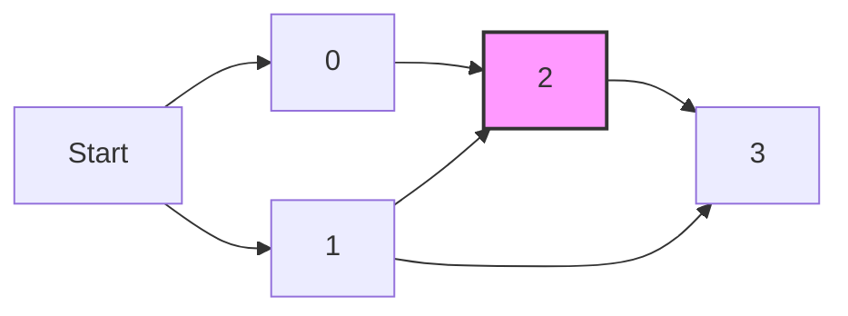

# 🪜 DP: Min Cost Climbing Stairs

## 📝 Problem Description
You are given an integer array `cost` where `cost[i]` is the cost of $i^{th}$ step on a staircase. Once you pay the cost, you can either climb one or two steps. You can either start from the step with index `0` or the step with index `1`. Return the minimum cost to reach the top of the floor (one step beyond the last index).

!!! info "Real-World Application"
    Used in optimization problems involving pathfinding with varying costs at nodes, such as resource scheduling or energy consumption minimization in hardware components.

## 🛠️ Constraints & Edge Cases
- $2 \le \text{cost.length} \le 1000$
- $0 \le \text{cost}[i] \le 999$
- **Edge Cases:** Array with minimum size (2 elements), high cost variations.

---

## 🧠 Approach & Intuition

!!! success "The Aha! Moment"
    The cost to reach step $i$ only depends on the minimum cost to reach step $i-1$ or $i-2$. We can compute this iteratively without storing the entire DP table.

### 🐢 Brute Force (Naive)
Recursive approach: `cost(i) = cost[i] + min(cost(i-1), cost(i-2))`. This has exponential time complexity $\mathcal{O}(2^N)$ due to redundant calculations.

### 🐇 Optimal Approach
Use bottom-up DP to compute costs iteratively. Since we only need the last two results, we use two variables to maintain $\mathcal{O}(1)$ space.
1. Initialize `prev2 = cost[0]`, `prev1 = cost[1]`.
2. For each step $i$ from 2 to $n-1$, compute `curr = cost[i] + min(prev1, prev2)`.
3. Update `prev2` and `prev1` for the next iteration.
4. The answer is `min(prev1, prev2)`.

### 🧩 Visual Tracing


---

## 💻 Solution Implementation

```python
(Implementation details need to be added...)
```

### ⏱️ Complexity Analysis
- **Time Complexity:** $\mathcal{O}(N)$ — We iterate through the array once.
- **Space Complexity:** $\mathcal{O}(1)$ — We use only two variables to store previous states.

---

## 🎤 Interview Toolkit

- **Harder Variant:** What if you can climb $k$ steps? (Requires a sliding window/queue or a deque to keep track of the minimum cost in the last $k$ steps, reducing complexity to $\mathcal{O}(NK)$ or $\mathcal{O}(N)$).
- **Alternative Data Structures:** Not needed for the optimal approach, but a list could be used if space constraints were relaxed.

## 🔗 Related Problems
- [Climbing Stairs](../climbing_stairs/PROBLEM.md) — Base version of this problem.
- [House Robber](../house_robber/PROBLEM.md) — Similar DP structure.
