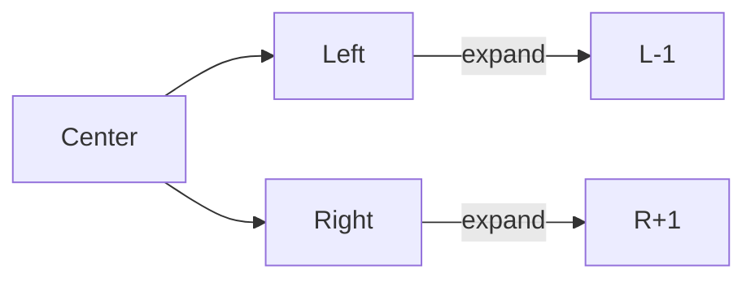

# 🪞 DP: Palindromic Substrings

## 📝 Problem Description
Given a string `s`, return the number of palindromic substrings in it. A string is a palindrome if it reads the same forward and backward. A substring is a contiguous sequence of characters.

!!! info "Real-World Application"
    Used in bioinformatics (identifying palindromic sequences in DNA), data compression, and text searching algorithms where structure detection is critical.

## 🛠️ Constraints & Edge Cases
- $1 \le \text{s.length} \le 1000$
- `s` consists of lowercase English letters.
- **Edge Cases:** Single character string (count 1), string with all same characters (e.g., "aaa").

---

## 🧠 Approach & Intuition

!!! success "The Aha! Moment"
    A palindrome is symmetric around its center. There are $2N-1$ possible centers (each character and the spaces between characters). Expanding from these centers allows us to count all palindromes efficiently.

### 🐢 Brute Force (Naive)
Generate all possible substrings ($\mathcal{O}(N^2)$) and check if each is a palindrome ($\mathcal{O}(N)$). Total time: $\mathcal{O}(N^3)$, leading to TLE.

### 🐇 Optimal Approach
Use the **Expand Around Center** strategy:
1. Iterate through each index `i` from $0$ to $n-1$.
2. Expand around center `i` for odd-length palindromes (left pointer `i`, right pointer `i`).
3. Expand around centers `i` and `i+1` for even-length palindromes.
4. Each successful expansion (while `left >= 0`, `right < n`, and `s[left] == s[right]`) corresponds to a unique palindromic substring.

### 🧩 Visual Tracing


---

## 💻 Solution Implementation

```python
(Implementation details need to be added...)
```

### ⏱️ Complexity Analysis
- **Time Complexity:** $\mathcal{O}(N^2)$ — We have $2N-1$ centers, and each expansion can take $\mathcal{O}(N)$ in the worst case (e.g., "aaaaa").
- **Space Complexity:** $\mathcal{O}(1)$ — No extra space is used for the logic.

---

## 🎤 Interview Toolkit

- **Harder Variant:** If you need to return the longest palindromic substring, use the same expansion logic but store the start and end indices of the longest one found.
- **Alternative Data Structures:** Manacher's Algorithm can solve this in $\mathcal{O}(N)$ time, but it is complex to implement and rarely required in interviews.

## 🔗 Related Problems
- [Longest Palindromic Substring](../longest_palindromic_substring/PROBLEM.md) — Solved using the same center-expansion logic.
- [Valid Palindrome](../../02_two_pointers/valid_palindrome/PROBLEM.md) — Base problem.
