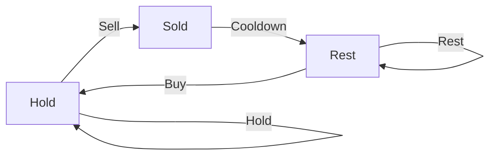

# 📉 Dynamic Programming: Best Time to Buy and Sell Stock with Cooldown

## 📝 Problem Description
You are given an array `prices` where `prices[i]` is the price of a given stock on the `i`th day. Find the maximum profit you can achieve. You may complete as many transactions as you like (i.e., buy one and sell one share of the stock multiple times) with the following restrictions:
- After you sell your stock, you cannot buy stock on the next day (i.e., cooldown one day).
- You may not engage in multiple transactions simultaneously.

!!! info "Real-World Application"
    This problem is a classic example of **state-machine based optimization**, often found in automated trading algorithms and resource management systems where specific action sequences (like a "cooldown" period) are required after performing a task.

## 🛠️ Constraints & Edge Cases
- $1 \le prices.length \le 5000$
- $0 \le prices[i] \le 1000$
- **Edge Cases to Watch:** 
    - Empty or single-day arrays (result is always 0).
    - Prices strictly decreasing (no profit possible).

---

## 🧠 Approach & Intuition

!!! success "The Aha! Moment"
    Instead of tracking time, track the **State** of your portfolio. On any given day, you can be in one of three states: holding a stock, having just sold a stock (cooldown), or resting. The transition between these states depends solely on the current price and your previous state.

### 🐢 Brute Force (Naive)
Trying every possible combination of buy/sell days results in an exponential $O(2^N)$ time complexity, as you explore all possible buy-sell-cooldown decision paths.

### 🐇 Optimal Approach
We maintain three variables representing the maximum profit at the end of each day in each state:
1. `hold`: Max profit while holding a stock (bought on or before today).
2. `sold`: Max profit having just sold a stock today.
3. `rest`: Max profit after a day of rest or cooldown.

Transitions:
- `new_hold = max(hold, rest - price)`
- `new_sold = hold + price`
- `new_rest = max(rest, sold)`

### 🧩 Visual Tracing


---

## 💻 Solution Implementation

```python
(Implementation details need to be added...)
```

### ⏱️ Complexity Analysis
- **Time Complexity:** $\mathcal{O}(N)$ — We iterate through the `prices` array exactly once.
- **Space Complexity:** $\mathcal{O}(1)$ — We use only three variables to store the state, regardless of input size.

---

## 🎤 Interview Toolkit

- **Harder Variant:** What if you had a transaction fee per sale? You would simply subtract the fee during the `sold` state transition.
- **Alternative:** Could be solved using a full 2D DP array of size $N \times 3$, but space optimization is standard for this problem.

## 🔗 Related Problems
- `[Coin Change II](../coin_change_ii/PROBLEM.md)`
- `[Longest Common Subsequence](../longest_common_subsequence/PROBLEM.md)`
