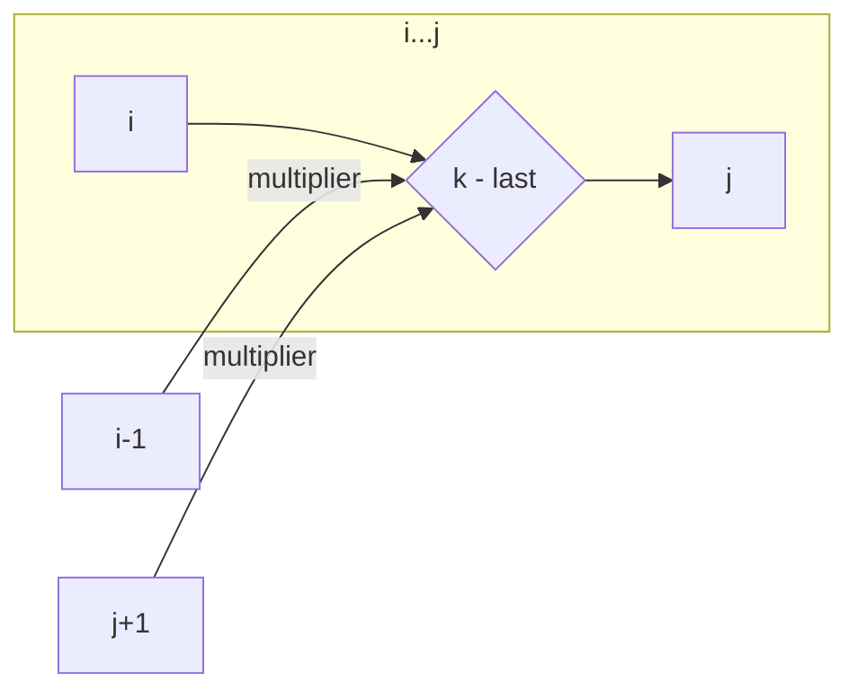

# 🎈 Dynamic Programming: Burst Balloons

## 📝 Problem Description
You are given `n` balloons, indexed from `0` to `n - 1`. Each balloon has a number painted on it, represented by an array `nums`. You are asked to burst all the balloons. If you burst the `i`th balloon, you get `nums[i - 1] * nums[i] * nums[i + 1]` coins. If `i - 1` or `i + 1` are out of bounds, treat them as `1`. Find the maximum coins you can collect.

!!! info "Real-World Application"
    This problem is a classic application of **Interval Dynamic Programming**, used in resource scheduling and optimization where the order of operations significantly impacts the outcome, often modeling scenarios like demolition ordering or sequence dependency management.

## 🛠️ Constraints & Edge Cases
- $1 \le n \le 500$
- $0 \le nums[i] \le 100$
- **Edge Cases to Watch:** 
    - Empty or single-balloon arrays.
    - Balloons with `0` value (they can be useful to burst last).

---

## 🧠 Approach & Intuition

!!! success "The Aha! Moment"
    Instead of deciding which balloon to burst first (which has complex dependencies), decide which balloon to burst **last**. If a balloon `k` is the last one to burst in a range `(i, j)`, the balloons `(i, k-1)` and `(k+1, j)` are already burst, and the neighbors of `k` are simply `i-1` and `j+1`.

### 🐢 Brute Force (Naive)
Trying every sequence of bursting balloons results in $O(N!)$ time complexity, which is computationally infeasible for even moderate $N$.

### 🐇 Optimal Approach
We use Interval DP. Let `dp[i][j]` be the maximum coins obtained by bursting all balloons between indices `i` and `j`. 
For each `k` in range `[i, j]` as the last balloon:
- `coins = nums[i-1] * nums[k] * nums[j+1]`
- `dp[i][j] = max(dp[i][j], dp[i][k-1] + coins + dp[k+1][j])`

### 🧩 Visual Tracing


---

## 💻 Solution Implementation

```python
(Implementation details need to be added...)
```

### ⏱️ Complexity Analysis
- **Time Complexity:** $\mathcal{O}(N^3)$ — We have two nested loops for the interval size and start index, plus a loop for the split point `k`.
- **Space Complexity:** $\mathcal{O}(N^2)$ — To store the DP table.

---

## 🎤 Interview Toolkit

- **Alternative:** Could be modeled as a recursive approach with memoization (top-down), which is often more intuitive to implement.
- **Related Patterns:** This is similar to Matrix Chain Multiplication or optimal Binary Search Tree construction.

## 🔗 Related Problems
- `[Regular Expression Matching](../regular_expression_matching/PROBLEM.md)`
- `[Edit Distance](../edit_distance/PROBLEM.md)`
