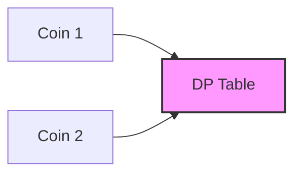

# 🪙 Dynamic Programming: Coin Change II

## 📝 Problem Description
You are given an integer array `coins` representing coins of different denominations and an integer `amount` representing a total amount of money. Return the number of combinations that make up that amount. If that amount of money cannot be made up by any combination of the coins, return 0.

!!! info "Real-World Application"
    This is a classic "Unbounded Knapsack" problem variation, widely used in financial systems, vending machine logic, and resource allocation where order of items does not matter but quantity combinations do.

## 🛠️ Constraints & Edge Cases
- $1 \le coins.length \le 300$
- $1 \le coins[i] \le 5000$
- $0 \le amount \le 5000$
- **Edge Cases to Watch:** 
    - Amount 0 (always 1 combination: empty set).
    - No coins provided for a non-zero amount.

---

## 🧠 Approach & Intuition

!!! success "The Aha! Moment"
    The order of the outer and inner loops matters. By iterating through `coins` first, we build the combinations for each amount one coin type at a time, effectively ensuring we don't count permutations (e.g., [1, 2] and [2, 1] are treated as one combination).

### 🐢 Brute Force (Naive)
Recursive backtracking explores every branch, resulting in exponential time complexity, essentially $O(coins^{amount})$, as it tries all possible counts of each coin.

### 🐇 Optimal Approach
We use 1D DP. Let `dp[i]` be the number of ways to make amount `i`.
1. Initialize `dp[0] = 1` (one way to make 0: use no coins).
2. For each coin `c` in `coins`:
    - Update `dp[x] += dp[x - c]` for all `x` from `c` to `amount`.

### 🧩 Visual Tracing


---

## 💻 Solution Implementation

```python
(Implementation details need to be added...)
```

### ⏱️ Complexity Analysis
- **Time Complexity:** $\mathcal{O}(N \times A)$, where $N$ is the number of coins and $A$ is the amount.
- **Space Complexity:** $\mathcal{O}(A)$ — We use an array of size `amount + 1` to track ways to make each total.

---

## 🎤 Interview Toolkit

- **Difference:** Contrast this with "Coin Change I" (min coins), which uses a similar approach but takes the `min` instead of sum.
- **Harder Variant:** What if you had to return the *combinations* themselves, not just the count?

## 🔗 Related Problems
- `[Best Time to Buy and Sell Stock with Cooldown](../best_time_to_buy_and_sell_stock_with_cooldown/PROBLEM.md)`
- `[Target Sum](../target_sum/PROBLEM.md)`
