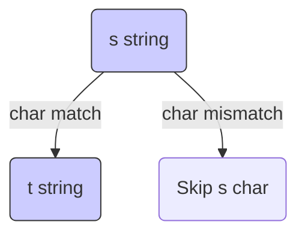

# 🧩 Dynamic Programming: Distinct Subsequences

## 📝 Problem Description
Given two strings `s` and `t`, return the number of distinct subsequences of `s` which equals `t`. A subsequence of a string is a new string formed from the original string by deleting zero or more characters without disturbing the relative positions of the remaining characters.

!!! info "Real-World Application"
    This problem is widely used in bioinformatics (DNA sequence alignment) and natural language processing (text analysis, grammar parsing) where comparing the structural similarity between sequences is crucial.

## 🛠️ Constraints & Edge Cases
- $1 \le s.length, t.length \le 1000$
- `s` and `t` consist of English letters.
- **Edge Cases to Watch:** 
    - `t` longer than `s` (result is 0).
    - Empty strings or identical strings.

---

## 🧠 Approach & Intuition

!!! success "The Aha! Moment"
    Use 2D DP. If `s[i] == t[j]`, you have two choices for the characters: include `s[i]` in the subsequence (adds `dp[i-1][j-1]` ways) or ignore `s[i]` and look for `t` earlier in `s` (adds `dp[i-1][j]` ways).

### 🐢 Brute Force (Naive)
Recursive exploration with overlapping subproblems results in $O(2^N)$ time, as each character can either be part of the subsequence or not, leading to a massive search space.

### 🐇 Optimal Approach
Let `dp[i][j]` be the number of distinct subsequences of `s[0...i-1]` that equal `t[0...j-1]`.
- If `s[i-1] == t[j-1]`: `dp[i][j] = dp[i-1][j-1] + dp[i-1][j]`
- If `s[i-1] != t[j-1]`: `dp[i][j] = dp[i-1][j]`

### 🧩 Visual Tracing


---

## 💻 Solution Implementation

```python
(Implementation details need to be added...)
```

### ⏱️ Complexity Analysis
- **Time Complexity:** $\mathcal{O}(M \times N)$ where $M, N$ are lengths of strings `s` and `t`.
- **Space Complexity:** $\mathcal{O}(M \times N)$ (can be optimized to $\mathcal{O}(N)$).

---

## 🎤 Interview Toolkit

- **Optimization:** Ask about optimizing space from $\mathcal{O}(M \times N)$ to $\mathcal{O}(N)$ using a single row DP array.
- **Related:** Similar to Edit Distance but counting occurrences instead of finding a minimum cost.

## 🔗 Related Problems
- `[Edit Distance](../edit_distance/PROBLEM.md)`
- `[Longest Common Subsequence](../longest_common_subsequence/PROBLEM.md)`
