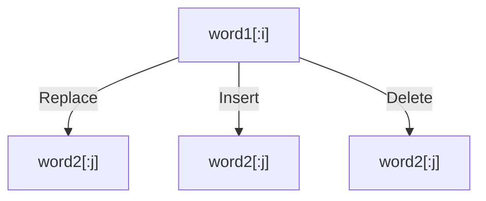

# ✏️ Dynamic Programming: Edit Distance

## 📝 Problem Description
Given two strings `word1` and `word2`, return the minimum number of operations required to convert `word1` to `word2`. You have the following three operations permitted on a word:
1. Insert a character.
2. Delete a character.
3. Replace a character.

!!! info "Real-World Application"
    Also known as Levenshtein distance, this is fundamental in spell checkers, DNA sequence alignment (bioinformatics), and natural language processing to quantify the difference between two strings.

## 🛠️ Constraints & Edge Cases
- $0 \le word1.length, word2.length \le 500$
- **Edge Cases to Watch:** 
    - Converting to/from empty strings (cost is equal to length).

---

## 🧠 Approach & Intuition

!!! success "The Aha! Moment"
    If the characters match, no action is needed (`dp[i-1][j-1]`). If they don't, you must consider all three operations (insert, delete, replace) and take the one that results in the minimum cost (plus 1).

### 🐢 Brute Force (Naive)
Recursive search through all edit sequences results in exponential time complexity, essentially checking every permutation of operations.

### 🐇 Optimal Approach
Use 2D DP. Let `dp[i][j]` be the minimum operations to convert `word1[:i]` to `word2[:j]`.
- If `word1[i-1] == word2[j-1]`: `dp[i][j] = dp[i-1][j-1]`
- Else: `dp[i][j] = 1 + min(dp[i][j-1], dp[i-1][j], dp[i-1][j-1])` (Insert, Delete, Replace).

### 🧩 Visual Tracing


---

## 💻 Solution Implementation

```python
(Implementation details need to be added...)
```

### ⏱️ Complexity Analysis
- **Time Complexity:** $\mathcal{O}(M \times N)$ — We fill an $M \times N$ DP table.
- **Space Complexity:** $\mathcal{O}(M \times N)$ — The table size.

---

## 🎤 Interview Toolkit

- **Optimization:** Ask about optimizing space from $\mathcal{O}(M \times N)$ to $\mathcal{O}(\min(M, N))$ using two rows.
- **Related:** Similar to LCS but with cost calculations.

## 🔗 Related Problems
- `[Distinct Subsequences](../distinct_subsequences/PROBLEM.md)`
- `[Longest Common Subsequence](../longest_common_subsequence/PROBLEM.md)`
