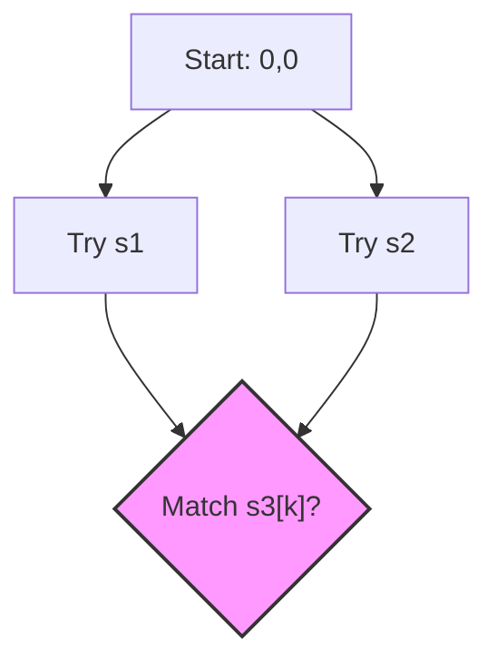

# 🔀 2D DP: Interleaving String

## 📝 Problem Description
Given strings `s1`, `s2`, and `s3`, determine if `s3` is formed by an interleaving of `s1` and `s2`. An interleaving is a configuration where `s1` and `s2` are partitioned into substrings that, when concatenated in a way that maintains the relative order of characters from `s1` and `s2`, form `s3`.

!!! info "Real-World Application"
    Interleaving is fundamental in bioinformatics (e.g., DNA sequence alignment) and compiler design (e.g., parsing token streams from multiple sources while maintaining order).

## 🛠️ Constraints & Edge Cases
- $0 \le |s1|, |s2| \le 100$
- $0 \le |s3| \le 200$
- **Edge Cases to Watch:** 
    - Empty strings ($s1, s2$ being empty).
    - Length mismatch ($|s1| + |s2| \neq |s3|$).

---

## 🧠 Approach & Intuition

!!! success "The Aha! Moment"
    The state isn't just about matching characters; it's about whether the *prefix* of `s3` can be formed by prefixes of `s1` and `s2`. We define `dp[i][j]` as a boolean: can `s3[:i+j]` be formed by `s1[:i]` and `s2[:j]`?

### 🐢 Brute Force (Naive)
Generating all interleavings using recursion creates an exponential number of paths ($O(2^{M+N})$), leading to time limit exceeded as branches are heavily duplicated.

### 🐇 Optimal Approach
Use Dynamic Programming to store results of sub-problems:
1. Initialize a 2D boolean table `dp[M+1][N+1]`.
2. `dp[i][j]` is true if:
   - `dp[i-1][j]` is true AND `s1[i-1] == s3[i+j-1]` (Character from `s1`)
   - OR
   - `dp[i][j-1]` is true AND `s2[j-1] == s3[i+j-1]` (Character from `s2`)

### 🧩 Visual Tracing


---

## 💻 Solution Implementation

```python
(Implementation details need to be added...)
```

### ⏱️ Complexity Analysis
- **Time Complexity:** $\mathcal{O}(M \cdot N)$ — We fill a table of size $(M+1) \times (N+1)$.
- **Space Complexity:** $\mathcal{O}(N)$ — Using a 1D DP array optimization (only keeping the current and previous row).

---

## 🎤 Interview Toolkit

- **Harder Variant:** Can you solve this with recursion + memoization (Top-Down)?
- **Alternative:** How does this differ from the "Edit Distance" problem? (Edit distance includes deletions/insertions/replacements, this is strict ordering).

## 🔗 Related Problems
- `Longest Common Subsequence` — Relies on 2D DP state management.
- `Edit Distance` — Shares similar 2D structure.
