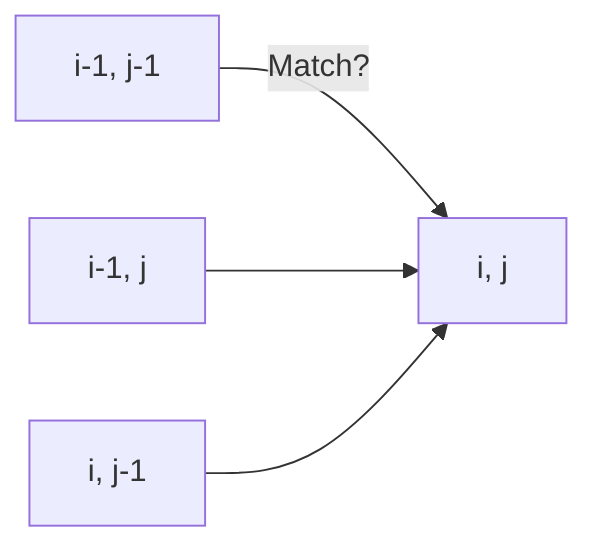

# 🧶 2D DP: Longest Common Subsequence

## 📝 Problem Description
Given two strings `text1` and `text2`, return the length of their longest common subsequence. A subsequence is a sequence that appears in the same relative order, but not necessarily contiguously.

!!! info "Real-World Application"
    LCS is the core algorithm behind `diff` utilities (Git, Linux `diff`), DNA sequence alignment in biology, and plagiarism detection software.

## 🛠️ Constraints & Edge Cases
- $1 \le |text1|, |text2| \le 1000$
- Strings consist of only lowercase English characters.
- **Edge Cases to Watch:** 
    - One string is empty (LCS = 0).
    - No common characters (LCS = 0).

---

## 🧠 Approach & Intuition

!!! success "The Aha! Moment"
    Don't compare all subsequences! If `text1[i] == text2[j]`, that character is part of the LCS. Otherwise, the LCS is the maximum of *either* excluding `text1[i]` *or* excluding `text2[j]`.

### 🐢 Brute Force (Naive)
Generating all subsequences is $O(2^N)$, resulting in exponential time complexity.

### 🐇 Optimal Approach
Use Dynamic Programming to store results:
1. `dp[i][j]` stores the LCS length of `text1[:i]` and `text2[:j]`.
2. Base case: `dp[0][j] = 0` and `dp[i][0] = 0`.
3. Transition:
   - If match: `dp[i][j] = 1 + dp[i-1][j-1]`.
   - Else: `dp[i][j] = max(dp[i-1][j], dp[i][j-1])`.

### 🧩 Visual Tracing


---

## 💻 Solution Implementation

```python
(Implementation details need to be added...)
```

### ⏱️ Complexity Analysis
- **Time Complexity:** $\mathcal{O}(M \cdot N)$ — We populate an $M \times N$ matrix exactly once.
- **Space Complexity:** $\mathcal{O}(M \cdot N)$ — (Can be optimized to $\mathcal{O}(\min(M, N))$).

---

## 🎤 Interview Toolkit

- **Harder Variant:** Print the subsequence itself (backtrack through the matrix).
- **Alternative:** Why not use a greedy approach? (Greedy fails because picking a match now might prevent a longer sequence later).

## 🔗 Related Problems
- `Edit Distance` — Very similar DP state transition.
- `Interleaving String` — Same 2D grid logic.
