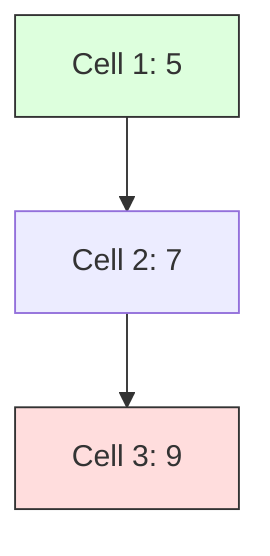

# 🏔️ 2D DP: Longest Increasing Path in a Matrix

## 📝 Problem Description
Given an `m x n` integer matrix, return the length of the longest increasing path. You can move in four directions (up, down, left, right). You cannot move diagonally or outside the boundary.

!!! info "Real-World Application"
    This problem is essential in topographical map analysis, finding optimal downhill/uphill paths in navigation systems, and image processing edge detection.

## 🛠️ Constraints & Edge Cases
- $1 \le m, n \le 200$
- $0 \le matrix[i][j] \le 2^{31} - 1$
- **Edge Cases to Watch:** Empty matrix, single cell matrix, strictly increasing vs. strictly decreasing paths.

---

## 🧠 Approach & Intuition

!!! success "The Aha! Moment"
    Since we can only move to a *strictly larger* neighbor, there are NO cycles. This means the matrix is a Directed Acyclic Graph (DAG)! We can use DFS with Memoization to cache the longest path from each cell.

### 🐢 Brute Force (Naive)
Executing a full DFS for every cell without caching recomputes the same paths repeatedly, leading to exponential $O(4^{M \cdot N})$ complexity.

### 🐇 Optimal Approach
1. Initialize a `memo` matrix of size $m \times n$ with $0$.
2. For each cell `(r, c)`, call `dfs(r, c)`.
3. In `dfs`:
    - Return `memo[r][c]` if computed.
    - Check 4 neighbors; if a neighbor is strictly larger, recursively call `dfs` and take the `max`.
4. Return `1 + max_neighbor_path`.

### 🧩 Visual Tracing


---

## 💻 Solution Implementation

```python
(Implementation details need to be added...)
```

### ⏱️ Complexity Analysis
- **Time Complexity:** $\mathcal{O}(M \cdot N)$ — Each cell is visited and computed exactly once due to memoization.
- **Space Complexity:** $\mathcal{O}(M \cdot N)$ — To store the `memo` table and recursion stack.

---

## 🎤 Interview Toolkit

- **Harder Variant:** What if you could move to *smaller* neighbors? (Cycles introduced, need Topological Sort or Bellman-Ford).
- **Alternative:** Could this be solved with Kahn's Algorithm (Topological Sort)? Yes, by treating cells as nodes and increasing neighbors as edges.

## 🔗 Related Problems
- `Longest Common Subsequence` — Another DAG-like DP problem.
- `Number of Islands` — Graph traversal.
