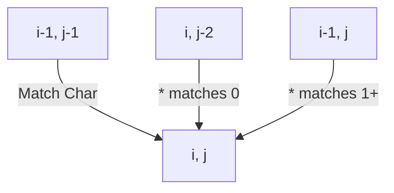

# 🧩 2D DP: Regular Expression Matching

## 📝 Problem Description
Implement support for regular expression matching with `.` (any single char) and `*` (zero or more of the preceding element). The match must cover the entire input string.

!!! info "Real-World Application"
    This is the core logic in text search engines (like grep), input validation, and lexical analyzers in compilers.

## 🛠️ Constraints & Edge Cases
- $0 \le |s| \le 20$, $0 \le |p| \le 30$
- **Edge Cases to Watch:** 
    - Empty pattern matching empty string.
    - Pattern with `*` as the first character (invalid, but usually not tested).
    - Patterns with multiple `*` in sequence (`a**`).

---

## 🧠 Approach & Intuition

!!! success "The Aha! Moment"
    The wildcard `*` is tricky! It means the preceding character can be used 0, 1, or many times. We build a 2D table `dp[i][j]` where `i` is the length of `s` and `j` is the length of `p`.

### 🐢 Brute Force (Naive)
Recursive matching explores all paths for `*`, which leads to an exponential $O(2^{M+N})$ complexity because of redundant sub-match calculations.

### 🐇 Optimal Approach
1. `dp[i][j]` = Does `s[:i]` match `p[:j]`?
2. If `p[j-1]` is a literal or `.`, look diagonally: `dp[i-1][j-1]`.
3. If `p[j-1]` is `*`:
   - Skip `*` (Zero occurrences): `dp[i][j-2]`.
   - Use `*` (One or more): `dp[i-1][j]` if the preceding pattern matches.

### 🧩 Visual Tracing


---

## 💻 Solution Implementation

```python
(Implementation details need to be added...)
```

### ⏱️ Complexity Analysis
- **Time Complexity:** $\mathcal{O}(M \cdot N)$ — We compute each state in the $M \times N$ matrix.
- **Space Complexity:** $\mathcal{O}(M \cdot N)$ — To store the match states.

---

## 🎤 Interview Toolkit

- **Harder Variant:** Add `+` (one or more) support.
- **Alternative:** Can you solve this using Backtracking? (Yes, but much slower without memoization).

## 🔗 Related Problems
- `Wildcard Matching` (`?` and `*`) — Similar but slightly simpler.
- `Edit Distance` — Shares 2D grid DP structure.
