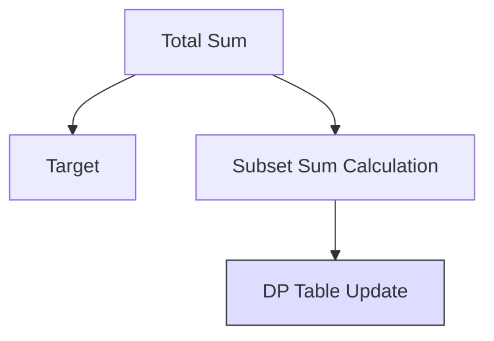

# 🎯 2D DP (Reduced): Target Sum

## 📝 Problem Description
Given an array `nums` and a `target`, add '+' or '-' before each element to make the total sum equal to `target`. Return the number of different ways.

!!! info "Real-World Application"
    This variation of the subset sum problem is used in resource allocation, balancing portfolios under constraints, and signal processing.

## 🛠️ Constraints & Edge Cases
- $1 \le |nums| \le 20$
- $0 \le nums[i] \le 1000$
- **Edge Cases to Watch:** Empty array, target sum impossible to reach, presence of zeros.

---

## 🧠 Approach & Intuition

!!! success "The Aha! Moment"
    This is a subset sum problem in disguise! If $P$ is the set of positive numbers and $N$ the set of negative:
    Sum(P) - Sum(N) = Target
    Sum(P) + Sum(N) = TotalSum
    Adding equations: 2 * Sum(P) = Target + TotalSum
    So, Sum(P) = (Target + TotalSum) / 2. We just need to find the number of ways to pick numbers to sum to `(Target + TotalSum) / 2`.

### 🐢 Brute Force (Naive)
Generating all possible combinations with signs is $O(2^N)$, which for $N=20$ is $\sim 10^6$ (manageable but slow) and gets worse as $N$ increases.

### 🐇 Optimal Approach
Use DP to count subsets summing to `(Target + TotalSum) / 2`.
1. Check if `(Target + TotalSum)` is even and non-negative.
2. Initialize `dp[subset_target + 1]` with `dp[0] = 1`.
3. For each number, iterate backwards (Knapsack style) and update `dp[j] += dp[j - num]`.

### 🧩 Visual Tracing


---

## 💻 Solution Implementation

```python
(Implementation details need to be added...)
```

### ⏱️ Complexity Analysis
- **Time Complexity:** $\mathcal{O}(N \cdot \text{Sum})$ — Where $N$ is count and $Sum$ is subset sum value.
- **Space Complexity:** $\mathcal{O}(\text{Sum})$ — Optimized to 1D array.

---

## 🎤 Interview Toolkit

- **Harder Variant:** What if you need to return the expressions themselves? (Use backtracking).
- **Alternative:** Is this the same as 0/1 Knapsack? Yes, it's a variation of "count ways to fill knapsack".

## 🔗 Related Problems
- `Coin Change II` — Similar counting subsets problem.
- `Partition Equal Subset Sum` — Same reduction logic.
