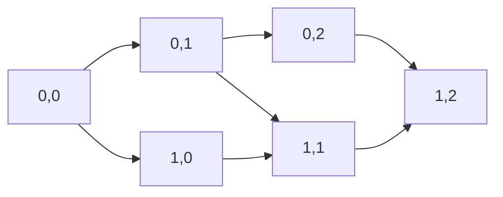

# 🤖 2D DP: Unique Paths

## 📝 Problem Description
There is a robot on an $m \times n$ grid. The robot is initially located at the top-left corner (i.e., `grid[0][0]`). The robot tries to move to the bottom-right corner (i.e., `grid[m - 1][n - 1]`). The robot can only move either down or right at any point in time. Given the two integers $m$ and $n$, return the number of possible unique paths that the robot can take to reach the bottom-right corner.

!!! info "Real-World Application"
    Grid-based pathfinding is fundamental in robotics for motion planning, in logistics for calculating delivery routes on a city block grid, and in game development for NPC navigation in structured maps.

## 🛠️ Constraints & Edge Cases
- $1 \le m, n \le 100$
- **Edge Cases to Watch:** 
    - $m=1$ or $n=1$: Only 1 path exists (straight line).
    - Large $m, n$: The number of paths can exceed $2^{31}-1$.

---

## 🧠 Approach & Intuition

!!! success "The Aha! Moment"
    The number of paths to any cell $(i, j)$ is the sum of the paths to the cell above $(i-1, j)$ and the cell to the left $(i, j-1)$. This allows us to build the solution incrementally.

### 🐢 Brute Force (Naive)
Using recursion: for every cell, we branch into two directions (down and right). This creates an exponential time complexity $\mathcal{O}(2^{m+n})$, which leads to redundant calculations of the same sub-grids.

### 🐇 Optimal Approach
We use Dynamic Programming. We can maintain a 1D row of size $n$ to store the number of ways to reach cells in the current row.
1. Initialize the row with all $1$s (representing the first row).
2. For each subsequent row, update each cell $j$ by adding the value of the cell to its left (`row[j-1]`) to its current value (which acts as the "top" cell `row[j]`).
3. After filling $m$ rows, the last element is the total paths.

### 🧩 Visual Tracing


---

## 💻 Solution Implementation

```python
(Implementation details need to be added...)
```

### ⏱️ Complexity Analysis
- **Time Complexity:** $\mathcal{O}(m \cdot n)$ — We iterate through the grid once.
- **Space Complexity:** $\mathcal{O}(n)$ — We only store the state of the current row being processed.

---

## 🎤 Interview Toolkit

- **Harder Variant:** What if obstacles are present in the grid? (See: *Unique Paths II*)
- **Alternative Approach:** Combinatorics. The robot must take exactly $m-1$ down moves and $n-1$ right moves. The total number of ways is $\binom{(m-1) + (n-1)}{m-1}$.

## 🔗 Related Problems
- `Unique Paths II` — Adds grid obstacles.
- `Climbing Stairs` — 1D version of the same additive logic.
- `Edit Distance` — 2D DP on strings.
