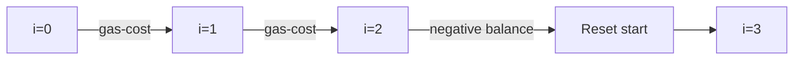

# ⛽ Greedy: Gas Station

## 📝 Problem Description
There are `n` gas stations along a circular route, where the amount of gas at the `i`th station is `gas[i]`. You have a car with an unlimited gas tank and it costs `cost[i]` of gas to travel from the `i`th station to its next `(i + 1)`th station. You begin the journey with an empty tank at one of the gas stations. Given two integer arrays `gas` and `cost`, return the starting gas station's index if you can travel around the circuit once in the clockwise direction, otherwise return `-1`. If there exists a solution, it is guaranteed to be unique.

!!! info "Real-World Application"
    This problem models circular resource allocation problems, such as finding a valid starting point for circular data buffer processing or efficient energy distribution in a microgrid.

## 🛠️ Constraints & Edge Cases
- $1 \le gas.length == cost.length \le 10^5$
- $0 \le gas[i], cost[i] \le 10^4$
- **Edge Cases:** Circular route with only one station, or where total gas is less than total cost.

---

## 🧠 Approach & Intuition

!!! success "The Aha! Moment"
    If the total amount of gas is less than the total cost, it's impossible to complete the circuit. If it's more, a solution is guaranteed. We just need to find the point where the cumulative tank balance doesn't drop below zero.

### 🐢 Brute Force (Naive)
Check every possible starting station by simulating the journey: $O(N^2)$.

### 🐇 Optimal Approach
1. Iterate through the stations, tracking the current tank balance.
2. If the balance drops below zero, the current start point is invalid.
3. Reset the start point to `i + 1` and reset the balance.

### 🧩 Visual Tracing


---

## 💻 Solution Implementation

```python
(Implementation details need to be added...)
```

### ⏱️ Complexity Analysis
- **Time Complexity:** $\mathcal{O}(N)$ — We traverse the arrays exactly once.
- **Space Complexity:** $\mathcal{O}(1)$ — We use only constant extra space.

---

## 🎤 Interview Toolkit

- **Harder Variant:** What if the route isn't perfectly circular but has variations in topology?
- **Alternative Data Structures:** Not required here, as the greedy approach is optimal.

## 🔗 Related Problems
- [Jump Game](../jump_game/PROBLEM.md) — Greedy strategy on array movement
