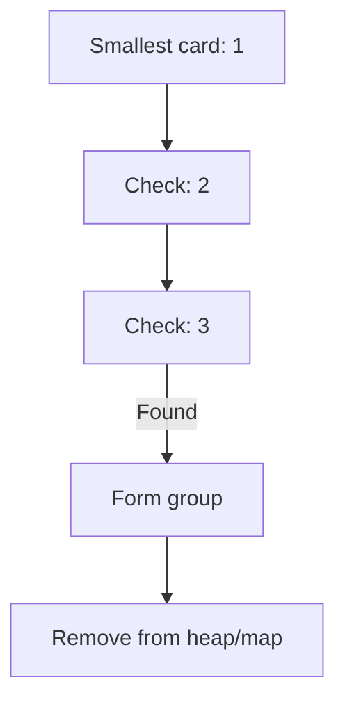

# 🃏 Greedy: Hand of Straights

## 📝 Problem Description
Alice has a `hand` of cards, and she wants to rearrange the cards into groups so that each group is of size `groupSize` and consists of `groupSize` consecutive cards. Return `true` if she can do this, otherwise return `false`.

!!! info "Real-World Application"
    This is a variant of the bin-packing problem, relevant in scheduling tasks that need to be grouped consecutively or in game logic (e.g., card games like Rummy).

## 🛠️ Constraints & Edge Cases
- $1 \le hand.length \le 10^4$
- $1 \le groupSize \le hand.length$
- **Edge Cases:** Empty hand, hand size not divisible by group size.

---

## 🧠 Approach & Intuition

!!! success "The Aha! Moment"
    Always start forming a group with the smallest available card. If we can't form a group of size `groupSize` starting from the smallest card, it's impossible.

### 🐢 Brute Force (Naive)
Sorting the array and trying every combination: $O(N \log N \cdot N)$.

### 🐇 Optimal Approach
1. Count the frequency of each card.
2. Use a min-heap to always pick the smallest card.
3. For each smallest card, check if the subsequent `groupSize - 1` cards exist.

### 🧩 Visual Tracing


---

## 💻 Solution Implementation

```python
(Implementation details need to be added...)
```

### ⏱️ Complexity Analysis
- **Time Complexity:** $\mathcal{O}(N \log N)$ — Sorting the keys into a heap takes $O(N \log N)$, then we process each card.
- **Space Complexity:** $\mathcal{O}(N)$ — For the hash map and the heap.

---

## 🎤 Interview Toolkit

- **Harder Variant:** What if the `groupSize` is dynamic per group?
- **Alternative Data Structures:** Using a Balanced BST instead of a heap.

## 🔗 Related Problems
- [Gas Station](../gas_station/PROBLEM.md)
